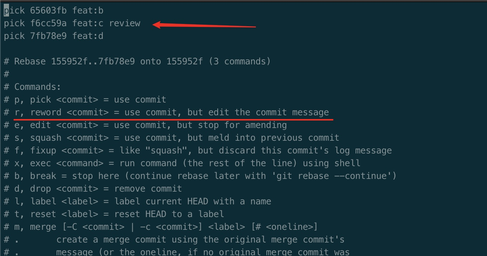
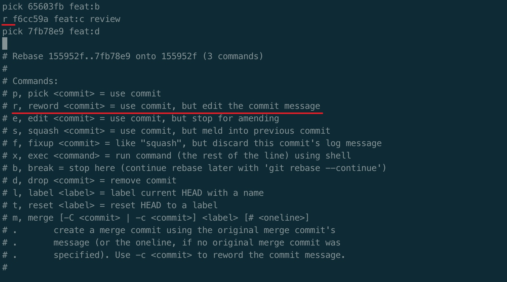
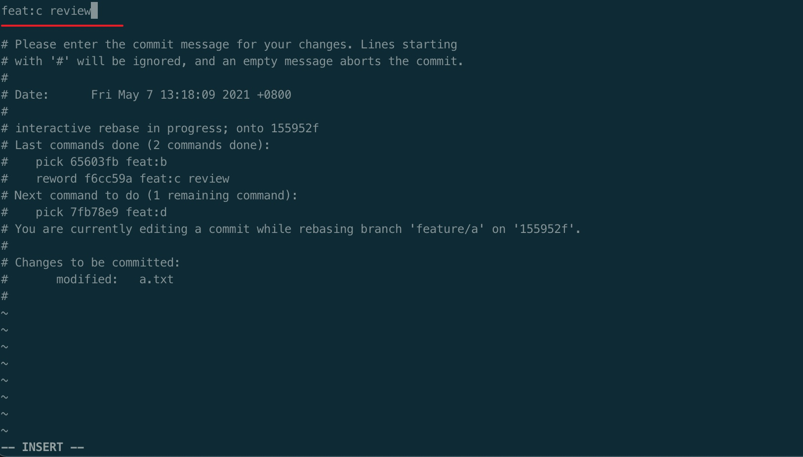
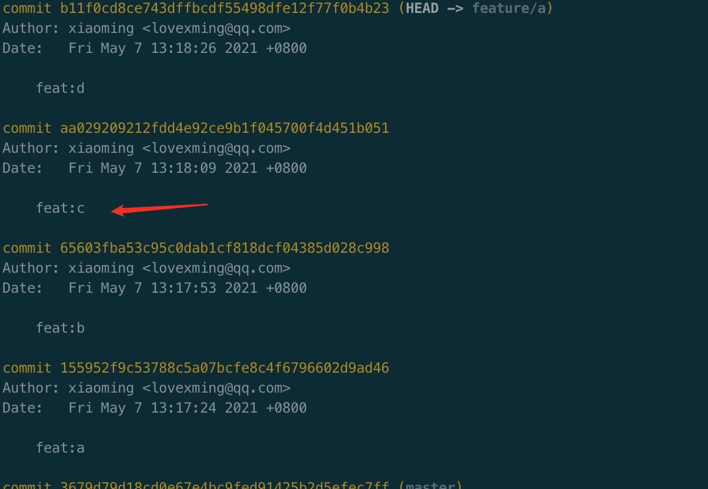
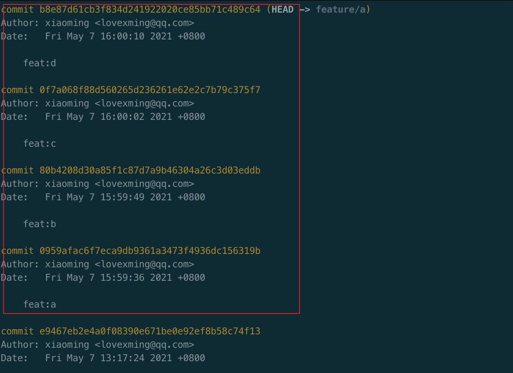
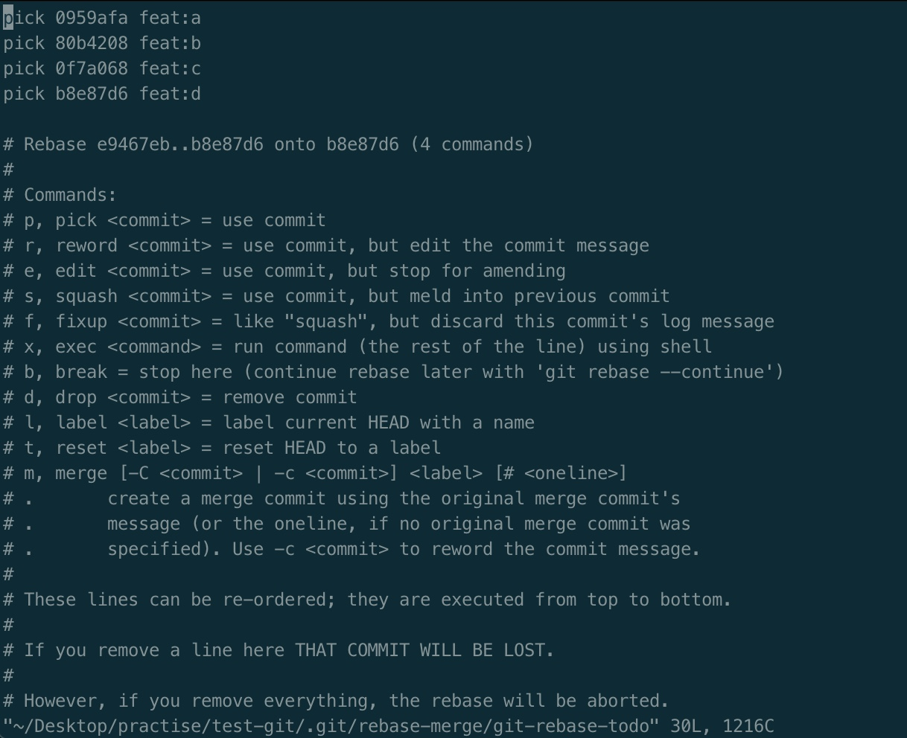
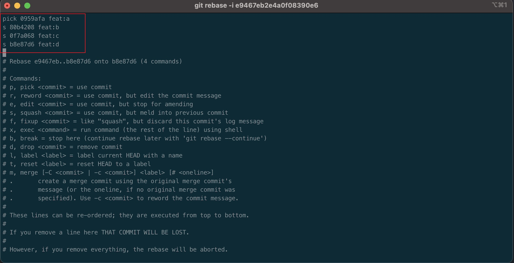
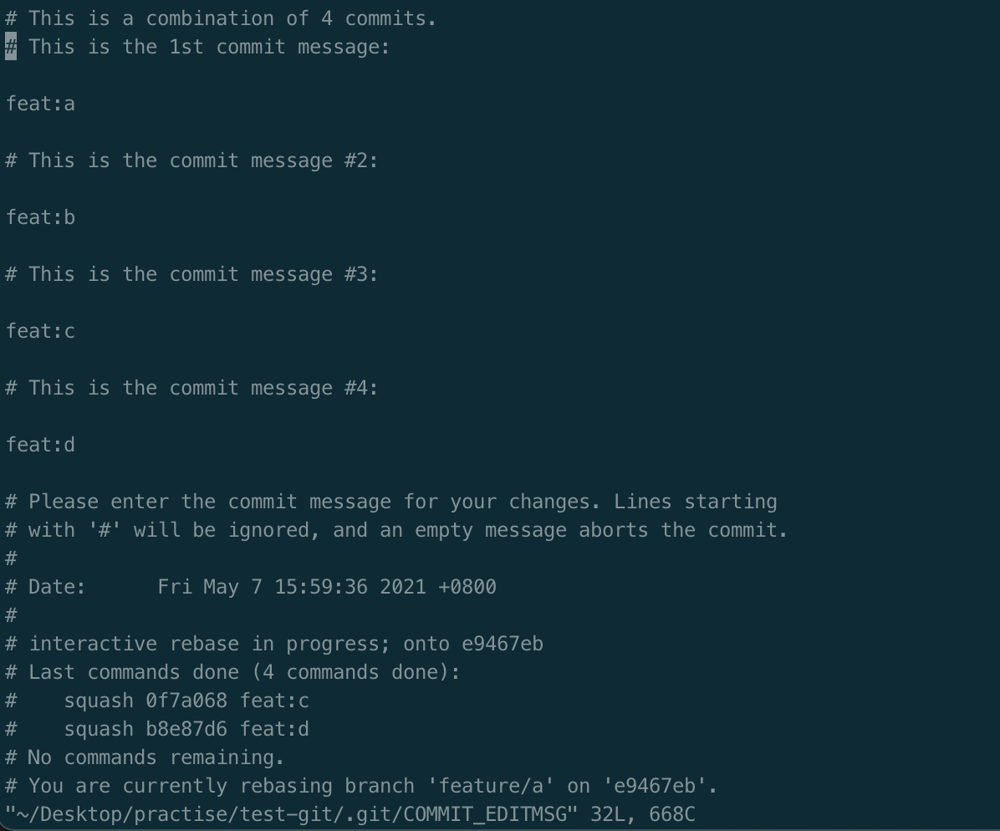
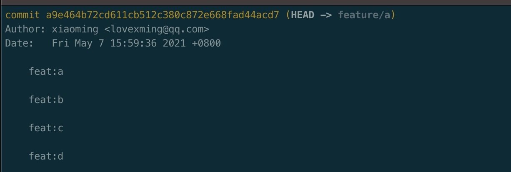

# git rebase

> 我认为 git 的 rebase 命令是非常神奇的，其中有很多相关的操作, commit message 的修改，连续或者间隔的 commit 的合并

## 如何对历史的 commit 的 message 进行变更呢？

上一个我们使用的是 `git commit --amend` 这次可以使用 `git rebase -i xxxx`

```bash
# 首先需要 执行 `git log 来查看当前需要修改分支的父亲(上一个)节点的 commit id`,然后输入
$ git rebase -i xxx
```

（如下图）可以看到父亲节点下面存在可以操作的几个子节点（开始的三行）


（如下图）那么就对其中的子节点（feat：c review）进行修改（其中 r 是简写，reword 是修改 message 的命令），修改完后 `:wq!` 直接退出编辑



在上一次编辑结束后，会自动跳到（如下图）的界面，然后可以在第一行上修改想要修改的内容，最后我修改成：`feat: c`，然后 `:wq!` 直接退出编辑，就修改完成



然后，打开 `git log` 查看记录，此时已经修改完成



---

## 如何对多个 commit 合成一个 commit

如果本地需要合成多个 commit （如下图所示）



那么也是使用 `git rebase -i <父子节点>` 来进行交互式操作,如果我需要把 `feat:a` `feat:b` `feat:c` `feat:d` 分支进行合并

那么就取 `feat:a` 的前一个 commit 进行操作 `git rebase -i e9467eb2e4a0f0839` 输入后（如下图）



上一节使用了 `reword` 来更改 message 信息，这次合并就需要使用 `squash` 命令

（如下图）直接使用简写 `s` 去代表 `squash`，说明那三个分支合到前面的分支去,然后 `:wq!` 退出编辑状态



退出编辑状态后，来到了合并的信息（如下图）,你可以写入你的合并 commit 的 messge，编辑成功后会在 message 中显示出来（备注不会显示），`:wq!` 退出编辑状态，就是编辑成功



最后通过 `git log` 查看合并 commit 的情况，显示这样就证明合并成功


