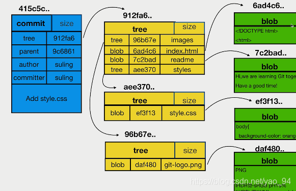
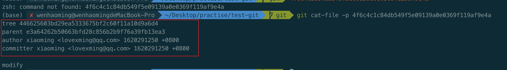
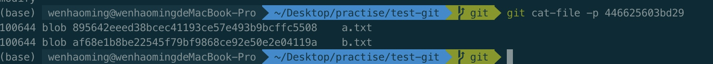
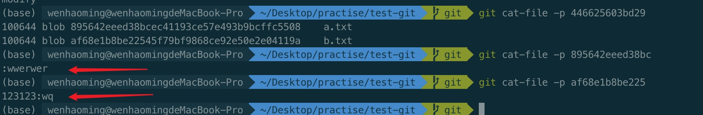

# git 对象彼此关系

> 使用 git 最基本的命令行就是 add 之后进行 commit，每次 commit 之后才能进行 push 操作，这些是大家都知道的步骤。而 git 中的三大对象 commit、tree 和 blob 又指的是什么，它们之间又有什么关系呢，对此进行简单介绍与记录。



## 他们的关系

commit -> tree -> blob

1. commit 就是每个提交的总内容
2. tree 类似每个文件的文件夹
3. blob 所有文件都统一以 blob 的形式

## 如何查看对应的内容呢？

```bash
$ got log #选中对应的 hash 版本
$ git cat-file -p <hash 版本>
```

例子：


那么我们需要查看内部的内容的话继续使用 `git cat-file -p <hash 版本>` 这个命令来打开 commit 内容文件夹



可以看到下面有两个 blob 文件，那么我们继续使用 `git cat-file -p <hash 版本>` 这个命令来打开 blob 的内容


