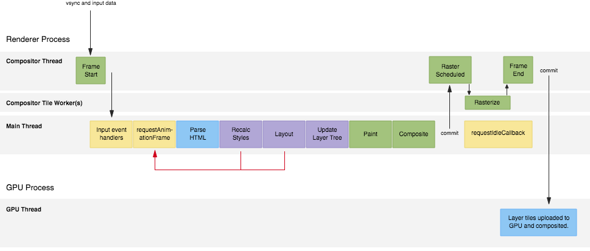
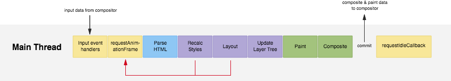

## 浏览器每一帧

浏览器在每一帧中都做了哪些事情？
何时以及为什么会触发？
如何将像素呈现至屏幕上？

让我们先从进程开始说起。

## 1. Renderer Process

浏览器一个标签页的周边容器。
它包含多个线程，它们共同负责在屏幕上显示页面的各个方面。
这些线程是 Compositor，Tile Worker，和 Main Thread。

## 2. GPU Process

这是为浏览器所有标签页和周边进程提供服务的单个进程。
随着帧的提交，GPU 进程会将任何图块和其他数据（如四边形顶点和矩阵）上传到 GPU，以实际将像素推送到屏幕。
GPU 进程包含一个单独的线程，称为 GPU 线程，它实际上完成了工作。

Renderer Process Threads
现在让我们看一下渲染进程中的线程。

### 1. Compositor Thread

这是第一个被告知 vsync 事件的线程（这是操作系统告诉浏览器创建新帧的方式）。
它还将接收任何输入事件。
如果可以的话，Compositor Thread 将避免进入 Main Thread，并尝试将输入（例如滚动）转换为屏幕上的移动。
它将通过更新层位置并通过 GPU 线程直接将帧提交到 GPU 来实现。
如果由于输入事件处理程序或其他可视化工作而无法执行此操作，则需要将工作提交给 Main Thread。

### 2. Main Thread

这是浏览器执行我们都知道和喜爱的任务的地方：JavaScript，样式，布局和绘画。（这将在 Houdini 的未来发生变化，我们将能够在 Compositor Thread 中运行一些代码。）
这个线程赢得了“最有可能导致卡顿”的奖励，主要是因为这里运行了太多任务。

### 3. Compositor Tile Worker(s)

由 Compositor Thread 生成的一个或多个工作程序，用于处理栅格化任务，我们稍后会详谈。

在许多方面，您应该将 Compositor Thread 视为“大老板”。
虽然它不运行 JavaScript，Layout，Paint 或其中任何一个，但它是完全负责初始化 Main Thread 工作，然后将帧传送到屏幕。
如果它不必等待输入事件处理程序，它可以在等待 Main Thread 完成其工作时，直接发送帧。

您也可以认为 Service Workers 和 Web Workers 存活在这个进程中，尽管我将它们排除在外，因为它使事情变得更加复杂。

# The Flow Of Things

让我们逐步完成从 vsync 到像素的流程，并讨论事情在 Main Thread 上是如何运作的。
值得记住的是，浏览器无需执行所有这些步骤，具体取决于所需的步骤。
例如，如果没有要解析的新 HTML，则不会触发 Parse HTML。
实际上，通常提高性能的最佳方法就是简单地消除对部分流程的需求！

同样值得注意的是，Recalc Styles 和 Layout 下的红色箭头，它们似乎是指向了 requestAnimationFrame 。
在代码中偶然触发两者是完全可能的。
这称为强制同步布局（或者样式），它通常不利于性能。

## 1. Frame Start

Vsync 事件触发后, 一个帧开始了。

## 2. Input event handlers

输入数据从 Compositor Thread 传递到 Main Thread 上的任何输入事件处理程序。
所有输入事件处理程序（touchmove，scroll，click）应首先触发，每帧一次，但不一定是这样， 调度程序会尽力尝试，其成功因操作系统而异。
从用户交互到 Main Thread 处理事件，这中间也存在一些延迟。

## 3. requestAnimationFrame

这是对屏幕进行可视更新的理想场所，因为您有新的输入数据，并且它与您将获得的 vsync 事件很接近。
其他视觉任务，如样式计算，将在此任务之后完成，因此这里是修改元素的理想时机。
如果你改变 - 比方说 - 100 个 class，这将不会导致 100 个样式计算；它们将被批量处理并稍后处理。
唯一需要注意的是，您不要查询任何计算样式或布局属性（如 el.style.backgroundImage 或 el.style.offsetWidth）。
如果你这样做，将会触发重新计算样式，布局或两者，再者，它会导致强制同步布局或者更糟糕的布局抖动。

## 4. Parse HTML

任何新添加的 HTML 都需要被处理，并创建 DOM 元素。
在页面加载期间或者之后诸如 appendChild 等操作，您都有可能看到很多这样的内容。

## 5. Recalc Styles

任何新添加或修改的内容都需要重新计算样式。
这可能是整棵树，或者它可以缩小范围，具体取决于更改的内容。
例如，更改 body 上的 class 可能是深远的，但值得注意的是，浏览器已经可以非常聪明地自动限制样式计算的范围。

## 6. Layout

为每个可见元素计算几何信息（每个元素的位置和大小）。
它通常用于整个文档，通常使计算成本与 DOM 大小成比例。

## 7. Update Layer Tree

创建堆叠上下文和深度排序元素的过程。

## 8. Paint

这是两部分过程中的第一部分：绘画是绘制调用的记录（例如在这里填充一个矩形，在那里写文本），用于任何新建的或者视觉发生变化的元素。
第二部分是栅格化（见下文），执行绘制调用，填充纹理。
这部分是绘制调用的记录，通常比栅格化快得多，但这两部分通常统称为“painting”。

## 9. Composite

计算图层和图块信息并将其传递回 Compositor Thread 以供其处理。
除其他外，这将解决诸如 will-change，重叠元素和任何硬件加速画布之类的事情。

## 10. Raster Scheduled and Rasterize

Paint 任务中记录的绘制调用会在这里执行。
这在 Compositor Tile Workers 中完成，其数量取决于平台和设备功能。
例如，在 Android 上，您通常会找到一个工作者，在桌面上您有时可以找到四个。
栅格化是根据图层完成的，每个图层都由图块组成。

## 11. Frame End

随着各个图层的图块都被栅格化、任何新图块都将和输入数据（可能已在事件处理程序中被更改）一起被提交给 GPU 线程。

## 12. Frame Ships

最后，但绝不是最不重要的，GPU 线程将图块上传到 GPU。
GPU，使用四边形和矩阵将图块绘制到屏幕上。

## 13. requestIdleCallback

如果 Main Thread 在帧结束时有空余时间，那么 requestIdleCallback 可以触发。
这是进行非必要工作的绝佳机会，例如收集统计数据。
如果您是刚接触 requestIdleCallback，可以在 Google Developers 上了解一下，它提供了更多细节。

> Reference
> https://aerotwist.com/blog/the-anatomy-of-a-frame/
> @hushicai
