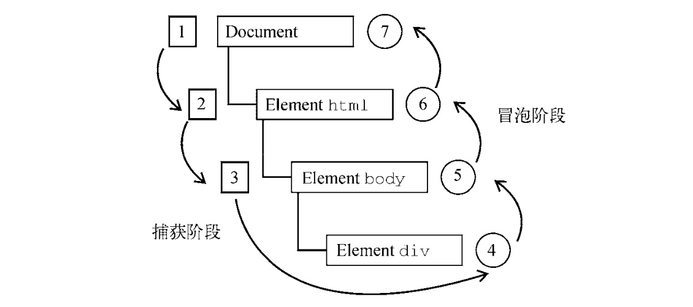
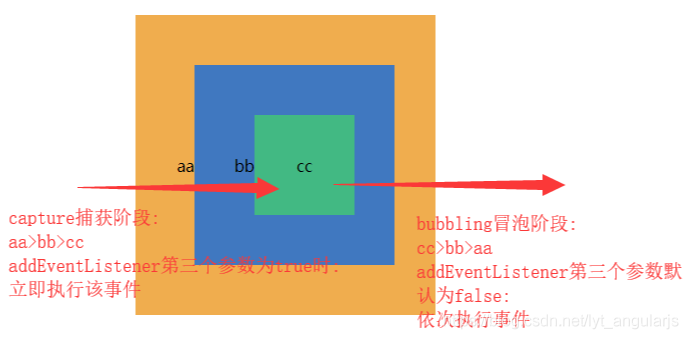

# 浏览器的事件

<Alert type="info">
<div>1. 理解事件流</div>
<div>2. 使用事件处理程序</div>
<div>3. 了解不同类型的事件</div>
</Alert>

## 事件流

> 所有现代浏览器都支持 DOM 事件流，只有 IE8 及更早版本不支持。

DOM2 Events 规范规定事件流分为 3 个阶段: `事件捕获`、`到达目标`和`事件冒泡`。事件捕获最先发生， 为提前拦截事件提供了可能。然后，实际的目标元素接收到事件。最后一个阶段是冒泡，最迟要在这个 阶段响应事件。



在 DOM 事件流中，实际的目标( `<div>` 元素)在捕获阶段不会接收到事件。这是因为捕获阶段从 document 到 `<html>` 再到 `<body>` 就结束了。下一阶段，即会在 `<div>` 元素上触发事件的 `“到达目标”` 阶段，通常在事件处理时被认为是冒泡阶段的一部分(稍后讨论)。然后，冒泡阶段开始，事件反向传播至文档。

## 事件处理程序

### HTML 事件处理程序

特定元素支持的每个事件都可以使用事件处理程序的名字以 HTML 属性的形式来指定。此时属性 的值必须是能够执行的 JavaScript 代码。

```html
<input type="button" value="Click Me" onclick="console.log('Clicked')" />
```

点击这个按钮后，控制台会输出一条消息。这种交互能力是通过为 onclick 属性指定 JavaScript 代码值来实现的。注意，因为属性的值是 JavaScript 代码，所以**不能在未经转义的情况下使用 HTML 语法字符，比如和号(&)、双引号(")、小于号(<)和大于号(>)**。

```html
<input type="button" value="Click Me" onclick='console.log("Clicked")' />
```

<Alert type="info">
<p style="font-size:18px">你知道在 html 的事件绑定有几种情况和其中中作用域的关系吗？</p>
</Alert>

<h4>第一种</h4>

```html
<script>
    function showMessage() {
        console.log('Hello world!');
    }
</script>

<input type="button" value="Click Me" onclick="showMessage()" />
```

在这个例子中，单击按钮会调用 showMessage()函数。showMessage()函数是在单独的`<script>` 元素中定义的，而且也可以在外部文件中定义。作为事件处理程序执行的代码`可以访问全局作用域中的一切`。

以这种方式指定的事件处理程序有一些特殊的地方。

首先，会**创建一个函数**来封装属性的值，这个 函数有一个特殊的局部变量 event，其中保存的就是 `event 对象`。

<h4>第二种</h4>

```html
<!-- 输出"Click Me" -->
<input type="button" value="Click Me" onclick="console.log(this.value)" />
```

这个动态创建的包装函数还有一个特别有意思的地方，就是其作用域链被扩展了。

在这个函数中， document 和元素自身的成员都可以被当成局部变量来访问。这是通过使用 `with` 实现的:

```js
    function(event) {
      with(document) {
        with(this) { // 属性值
        // someting
        }
      }
    }
```

等价于

```html
<!-- 输出"Click Me" -->
<input type="button" value="Click Me" onclick="console.log(value)" />
```

<h4>第三种</h4>

```html
<form method="post">
    <input type="text" name="username" value="" />
    <input
        type="button"
        value="Echo Username"
        onclick="console.log(username.value)"
    />
</form>
```

如果这个元素是一个表单输入框，则作用域链中还会包含表单元素，事件处理程序对应的函数等价 于如下这样:

```js
  function(event) {
      with(document) {
        with(this.form) {
            with(this) { // 属性值
                // someting
            }
        }
      }
   }
```

<h4>第四种</h4>

在第一种情况下，存在一种情况就是，dom 已经加载完成，外部脚本没加载完全的情况下，直接点击事件处理会出现报错，这就涉及到`加载顺序`的问题，不过通常遇到这种情况下，都会使用 `try-catch` 来解决。

```html
<input
    type="button"
    value="Click Me"
    onclick="try{showMessage();}catch(ex) {}"
/>
```

这样，如果在 showMessage()函数被定义之前点击了按钮，就不会发生 JavaScript 错误了，这是因 为错误在浏览器收到之前已经被拦截了。

<h4>结论</h4>
使用 HTML 指定事件处理程序的最后一个问题是 HTML 与 JavaScript 强耦合。如果需要修改事件处 理程序，则必须在两个地方，即 HTML 和 JavaScript 中，修改代码。这也是很多开发者不使用 HTML 事件处理程序，而使用 JavaScript 指定事件处理程序的主要原因。

## 事件绑定

1. onclick（既可以在 html 中使用也可以在 js 脚本使用）
2. addEventListener
3. attachEvent（IE9）

```js
document.onclick = () => {
    console.log('onclick');
};
document.addEventListener('click', () => console.log('addEventListener'));
document.addEventListener('click', () => console.log('addEventListener2'));

// 最后点击 document 打印
// onclick
// addEventListener
// addEventListener2
```

在 `addEventListener` 中无疑是用得最多的，因为这种绑定形式单一事件类型能绑定多个函数，同时第三个参数也有不同作用。

[MDN 中对该 api 有详细的解释](https://developer.mozilla.org/zh-CN/docs/Web/API/EventTarget/addEventListener)

关于 第三个参数 `useCapture`，默认也就是 false 为`冒泡阶段`，也就是 cc > bb > aa，如果为 true 时，就是`捕获阶段`，也就是 aa > bb > cc



第三个参数除了可以是一个 boolean 值，还可以使一个 options

```js
addEventListener(type, listener, {
    capture: false, // 和 `useCapture` 效果相同
    once: false, // listener 只绑定触发一次
    passive: false, // 不拦截默认事件
});
```

<Alert type="warning">
  <strong>passive</strong> 主要用于 移动端的 touch 事件，并且从 chrome56 开始，在 window、document 和 body 上注册的 touchstart 和 touchmove 事件处理函数，会默认为是 passive: true。浏览器忽略 preventDefault() 就可以第一时间滚动。
</Alert>
