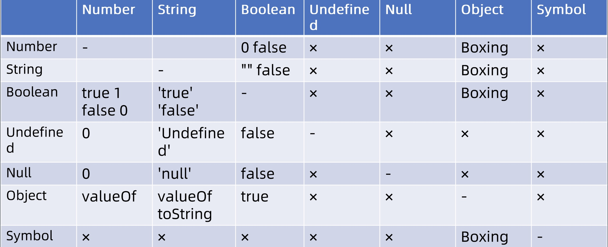

# ecma262 —— javascript Expression

> ecma262 201 page

## Grammar（语法）

-   Left Handside Expression
    -   [Member Expression](#member-expression-成员表达式) 成员表达式
    -   [new Expression](#new-expression-new-表达式) new 表达式
    -   [call Expression](#call-expression-调用表达式) 调用表达式
-   right Handside Expression
    -   [Update]()

### Member Expression 成员表达式

-   a.b
-   a[b]
-   foo\`string\`
-   super.b
-   super['b']
-   new.target
-   new Foo()

#### foo\`string\`

函数后面拼接模板字符串

```js
function foo(...args) {
    console.log(args);
}

foo`1 ${2}!45`; //[["1 ", "!45"], 2]
```

#### new.target

[MDN](https://developer.mozilla.org/zh-CN/docs/Web/JavaScript/Reference/Operators/new.target#%E6%9E%84%E9%80%A0%E6%96%B9%E6%B3%95%E4%B8%AD%E7%9A%84_new.target)

new.target 只能在函数中或者 es6 的类中使用，通常是被用作判断是否能被 new 的操作，如果在函数中被 new 那就会指向该 new 出来的对象，否则报错

```js
function foo() {
    console.log(new.target);
}

foo(); // undefined
new foo(); // ƒ foo(){console.log(new.target)}
```

### new Expression new 表达式

new foo()

```js
function foo1() {}
function foo2() {
    return foo1;
}

// 以下都是 foo1 函数
new foo2(); // function foo1(){}
new foo2(); // function foo1(){}

// 以下都是 foo1对象
new (foo2())(); // foo1 {}
new new foo2()(); // foo1 {}
new new foo2()(); // foo1 {}

// 传参的情况
function foo3() {
    console.log('3');
}
function foo4(x) {
    console.log('4', x);
    return foo3;
}
new new foo4('foo4')();
// 4 foo4
// 3
// foo3 {}
new new foo4('foo4')();
// 4 foo4
// 3
// foo3 {}
```

总结以上几种情况，拥有括号的会先去执行

<Alert>
Member Expression，返回的都是 Reference 类型，那么 Reference 是什么东西呢？我们来看一个例子。
</Alert>

```js
let o = { a: 1 };
o.b = 2;

delete o.b;
delete 2;
```

有没有想过 `o.b` 其实和 `2` 这两个结果其实是等效的，但是我们都知道最后的表现形式是不相同的，那么 `o.b` 其实就是一个 [Reference](https://developer.mozilla.org/en-US/docs/Web/JavaScript/Reference) 类型。

### call Expression 调用表达式

-   call
    -   foo()
    -   super()
    -   foo()['b']
    -   foo().b
    -   foo()`abc`

```js
class foo {
    constructor() {
        this.b = 1;
    }
}
new foo()['b']; // 1

foo['b'] = function() {};

new foo['b'](); // foo.b {}
```

从以上这三种 **Expression** 都统称为 `Left Handside Expression`，只要有函数调用参与的 Call Expression，它的优先级就比 new 更低

总结：

```js
function foo() {}
function foo2() {}
foo2.b = foo;
new foo2().b; // undefined  这里可以解析成 (new foo2()).b ,这样就可以认为 new Expression > Call Expression
new foo2.b(); // foo {}      这里可以解析成 new foo2.b()   ,这样就可以认为 Member Expression > new Expression
```

### Update Expression 更新表达式

> ECMA-262.pdf 178

-   a ++
-   a --
-   -- a
-   ++ a

### Unary Expression 单目运算符

-   `delete a.b`
-   `void foo()`
-   `typeof a`
-   `+ a`
-   `- a`
-   `~ a`
-   `! a`
-   `await a`

#### void foo()

`void` 的右边表达式仍旧执行，但是 void 的赋值语句最后都是 `undefined`, 那么问题来了，为什么会有 `void 0` 用来代表 undefined 去赋值呢？

**undefined 可以是一个变量。**

```js
// 由于 javascript 的设计问题~
// undefined 这个不是一个关键字，它是一个特殊的全局变量，它可以被定义，但是在全局中定义没效果，如果在局部作用域下就有被修改的能力；
function a() {
    let undefined = '123';
    console.log(undefined);
}
a(); // 打印出 123

window.undefined = 123;
console.log(window.undefined); // undefined
```

**括号包裹的 IIFE 如果前面没有分号会出现报错。**

```js
// 如果 123 后面忘记带分号的情况下 ❌
let a = 123(function() {
    return 1;
})(); // VM2854:2 Uncaught TypeError: 123 is not a function

// 最佳实践 ✅
let a = 123;
void (function() {
    return 1;
})();
```

<Alert type="info">综合以上，最佳实践就是使用 <strong>void 0</strong> 来代表 undefined 去赋值，另外遇到 IIFE 的时候最好也使用 void 来返回 IIFE</Alert>

#### typeof

`typeof` 中有两个特殊的现象

```js
typeof function() {}; // "function"
typeof {}; // "object"
```

### Exponental Expression 乘方

```js
2 ** 3; // 8 = 2*2*2
```

### Multiplicative 倍增

-   `*`
-   `/`
-   `%`

### Additive 加法

-   `+`
-   `-`

### Shift

-   `<<`
-   `>>`
-   `>>>`

### Relationship

-   `<`
-   `>`
-   `<=`
-   `>=`
-   `instanceof`
-   `in`

### Logical

-   `&&`
-   `||`

### Conditional

-   `? :`

## Type Convertion 类型转换



### Boxing 装箱

装箱的操作有三种，一种就是 `new` 对应原始值的构造函数，其中有 `Number`，`String`，`Boolean`，这几个原始类型有装箱的类型，另一种就是可以使用 `Object` 对原始值进行装箱操作`(Symbol只能使用Object方式来装箱)`，最后一种使用 apply

第一种：使用构造函数

```js
// String
'123'.length; // 当属性访问的时候，就会进行装箱的操作
new String('123').length; // 123

// Number
(1.3).toFixed();
new Number(1.3).toFixed(); // 1

// Boolean
new Boolean(1);

// Symbol
// Symbol 不能进行 new操作，但是能够通过 Object进行装箱
```

第二种：使用 Object 构造函数

```js
// Object（只有这4中可以装箱）
new Object('string'); // String {"string"}
new Object(1234); // Number {1234}
new Object(true); // Boolean {true}
new Object(Symbol(1)); //Symbol {Symbol(1)}

new Object(null); // {} 无效
new Object(undefined); // {} 无效
```

第三种：apply

```js
(function() {
    return this;
}
    .apply(String('x'))(function() {
        return this;
    })
    .apply(Number(1))(function() {
        return this;
    })
    .apply(Boolean(true))(function() {
        return this;
    })
    .apply(Symbol('x')));
```

### Unboxing 拆箱

拆箱就是`对象`转化成`原始值`而进行的类型转换的操作。

```js
1 + {}; // "1[object Object]"

1 +
    {
        valueOf() {
            return 1;
        },
    }; // 2

1 +
    {
        valueOf() {
            return 1;
        },
        toString() {
            return 2;
        },
    }; // 2 有 toString 的时候还是使用 valueOf 的方法

1 +
    {
        valueOf() {
            return 1;
        },
        toString() {
            return 2;
        },
        [Symbol.toPrimitive]() {
            return 3;
        },
    }; // 4 调用了 Symbol.toPrimitive 这个方法，实际是最优先
```

[mdn 对于 toPrimitive 的解释](https://developer.mozilla.org/zh-CN/docs/Web/JavaScript/Reference/Global_Objects/Symbol/toPrimitive)

```js
// 如果 Symbol.toPrimitive 直接返回 对象会直接报错
1 +
    {
        valueOf() {
            return 1;
        },
        toString() {
            return 2;
        },
        [Symbol.toPrimitive]() {
            return {};
        },
    }; // Uncaught TypeError: Cannot convert object to primitive value

// 但是如果换作 valueOf 返回一个对象，那么最后会绕过 valueOf 的执行，去执行 toString，这是因为内部是使用 Symbol.toPrimitive 的默认规则，这个默认规则里有如何分配valueof 或者 toString 到底谁来调用，很显然这里是使用了 toString
1 +
    {
        valueOf() {
            return {};
        },
        toString() {
            return 2;
        },
    }; // 3
```

<!-- ## runtime（运行时） -->
