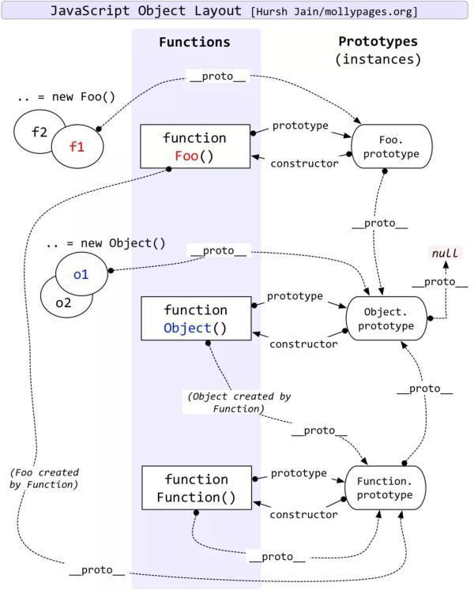

# javascript 的语句和对象

<Alert>
<p>问题：</p>
<div>
1. 关于 javascript 的语句你了解多少种形式？
</div>
<div>
2. Iterator 和 generator 还有 async 和 await 有什么关系？如何使用？
</div>
<div>
3. try catch 的 catch 是一个独立的 block 吗？
</div>
<div>
3. var 到底隐藏有多少坑？
</div>
<div>
4. javascript 中对象如何的 key 和 value 有几种类型？
</div>
<div>
4. javascript 中原型如何理解？
</div>
</Alert>

## Grammar

-   Atom
    -   Grammar
        -   简单语句
        -   组合语句
        -   声明
    -   Runtime
        -   Completion Record（完成语句）
        -   Lexical enviorment（词法环境）

### 简单语句

-   ExpressionStatement
-   EmptyStatement
-   DebuggerStatement
-   ThrowStatement
-   ContineStatement
-   BreakStatement
-   ReturnStatement

简单概括以下几种形式（简单过一下）

```js
a = 1 + 2;
debugger;
throw a;
continue label1;
break label2;
return 1 + 2;
```

### 复合语句（⭐️ 重点解释）

-   BlockStatement
-   ifStatement
-   SwitchStatement
-   IterationStatement
-   WithStatement
-   LabelledStatement
-   TryStatement

#### BlockStatement

```js
{
    // xxx
}

{
    const a = 1;
    console.log(a);
}
// 1
{
    const a = 2;
    console.log(a);
}
// 2
```

以上不会报错，由于存在各自的 block

#### IterationStatement

-   while()
-   do()while()
-   for( ; ; )
-   for( in )
-   for( of )

`for in` 的使用上需要检查 key 是否是当前对象的属性而不是原型上的属性 使用 `hasOwnProperty` 来判断是否对象上的属性。

其中 `for of` 比较特殊，只要有可迭代的对象都能用 `for of` 来访问

```js
function* run() {
    yield 1;
    yield 2;
    yield 3;
}
for (let val of run()) {
    // generator 函数执行后返回一个可迭代对象
    console.log(val);
}
// 1
// 2
// 3
```

#### TryStatement

```js
try {
} catch (e) {
} finally {
}
```

```js
var e = 3;
try {
    throw 2;
} catch (e) {
    console.log(e); // 2 ⭐️证明这里会存在一个作用域机制
}
console.log(e); // 3
```

### 声明

-   FunctionDeclaration
-   GeneratorDeclaration
-   AsyncFunctionDeclaration
-   AsyncGeneratorDeclaration
-   VariableStatement
-   ClassDeclaration
-   LexicalDeclaration

#### FunctionDeclaration

```js
function fn() {} //函数声明

const fn1 = function() {}; // 函数表达式
```

#### GeneratorDeclaration

```js
function* foo() {
    let i = 0;

    while (true) {
        yield i++;
    }
}
let gen = foo();

gen.next(); // {value: 0, done: false}
gen.next(); // {value: 1, done: false}
gen.next(); // {value: 2, done: false}
// 不需要担心函数内部的 while(true) 的无限循环，因为在 generator 中是会阻塞的
```

#### generator 和 async await 搭配使用（在 generator 函数中也可以使用 async await）

```js
function sleep(d) {
    return new Promise(resolve => setTimeout(resolve, d));
}
async function* foo() {
    var i = 0;
    while (true) {
        yield i++;
        await sleep(1000);
    }
}
void (async function() {
    var g = foo();
    for await (let e of g) {
        // 注意这里
        console.log(e);
    }
})();
// 1
// 2
// 3
// 4
// 5
// ...
```

#### VariableStatement

关于函数中 var 的表现形式

```js
var x = 0;

function foo() {
    var o = { x: 2 };
    x = 2;
    with (o) {
        var x = 3;
    }
    console.log(x);
}
foo(); // ?
console.log(x); // ?
```

你知道以上打印结果是什么吗？

```js
// 答案是：
foo(); //  2
console.log(x); // 0
```

请问你答对了吗？

我们分析一下其中的一个过程，其中 在 `with` 中，`var x = 3` 并没有改变 `x = 2` 的值，并且 `x = 2` 也没有改变全局的 `x = 0` 的值，但是实际上，由于 `with` 的存在，`x = 3` 实际上是改了 `var o = {x:2}` 的值，改成 `var o = {x:3}`

那如果把上面的稍微改一下，把 `with` 中的 `var` 声名去掉，答案是怎么样呢？

```js
var x = 0;

function foo() {
    var o = { x: 2 };
    x = 2;
    with (o) {
        x = 3;
    }
    console.log(x);
}
foo(); // ?
console.log(x); // ?
```

```js
// 答案是：
foo(); //  2
console.log(x); // 2
```

其中很显然，`x = 2`，把外面的 `var x = 0`，结果给改了，`x = 3`，效果还是原来效果不变

再来一个例子

```js
var x = 3;
function foo() {
    var o = { x: 1 };
    x = 2;
    if (false) {
        var x = 1;
    }
    console.log(x); // 2
    return;
}
```

上面这个例子，在 `if` 里面，即使是 false 不走里面的逻辑，`var x = 1;` 也改变了 `x = 2`

结论：

1. 只要是函数里面有 `var`，那么作用效果是整个函数作用域，比如（上面的例子，`var x = 3` 的效果最后改变的效果是作用域 `x = 2`）
2. `var` 最好写在函数内最前面或变量第一次出现的地方

<!-- ## Completion Record

- [[type]]：normal, break, coutinue, return or throw
- [[value]]：Types
- [[target]]：label -->

## javascript 的对象模型（Object in javascript）

> 在 javascript 运行时，原生对象的描述方式非常简单，我们只需要关心原型和属性两个部分（运行时没有方法的概念）。

在 javascript 中 key 有 `Symbol` 和 `String` 两类，value 有 `Data` 和 `Accessor`，一般来说数据属性描述状态，访问器属性描述行为，`数据属性如果存储函数，也可以描述行为`。

```
   let obj =  {
       [Symbol | String]: Data | Accessor
   }
```

-   Data Property（数据属性）

    -   [[value]]（对象属性的默认值，默认值为 undefined）
    -   writable （对象属性是否可修改,flase 为不可修改，默认值为 true）
    -   enumerable（对象属性是否可通过 for-in 循环，flase 为不可循环，默认值为 true）
    -   configurable（能否使用 delete、能否需改属性特性、或能否修改访问器属性、，false 为不可重新定义，默认值为 true）

-   Accessor Property（访问器属性）
    -   get
    -   set
    -   enumerable
    -   configurable

### 原型 prototype

当我们访问属性时，如果当前对象没有，则会沿着原型找原型对象是否有此名称的属性，因此会有原型链这个说法，这一算法保证了，每个对象要描述自己和原型的区别即可。

### Grammar (Api)

-   {},[],Object.defineProperty -- **基本对象能力，创建对象**
-   Object.create / Object.setPropertyOf / Object.getPropertyOf -- **es5 的基础上一些原型 api**
-   new / class / extends -- **es6 中用原型的形式去模拟类**
-   new / function /property -- **过去的老方法（不建议使用**

### Function object

javascript 中有一种特殊的对象就是函数，除了属性和原型，函数对象有一个行为就是 [[call]]，`function`，`箭头函数`,`Function 构造函数`都有[[call]]这个行为。

当我们 f()，把对象当做函数会访问到 [[call]] 这个行为。

```
Object
[[call]]
```

列举 javascript 中函数的行为

```js
Number(); //0

new Number(); // Number {0}

function fn() {
    return 1;
}
new fn(); //fn {}

// new 后结果被改写
function fn() {
    return { a: 1 };
}
new fn(); //fn {a:1}

// 只要这个对象能 [[call]] 就是 function
typeof window.alert; // function
```

<Alert>
我们都知道数组的 length 属性的特殊性，当数组成员定义时，length 会动态改变，那么数组的 length 到底是数据属性，还是访问器属性？
</Alert>

```js
let arr = [];
arr[100] = 1;
arr.length; // 101

Object.getOwnPropertyDescriptor(arr, 'length'); // {value: 101, writable: true, enumerable: false, configurable: false}
```

通过 [Object.getOwnPropertyDescriptor](https://developer.mozilla.org/zh-CN/docs/Web/JavaScript/Reference/Global_Objects/Object/getOwnPropertyDescriptor) 属性描述符，来判断 `length` 其实是数据属性。

### javascript 的原型链关系


