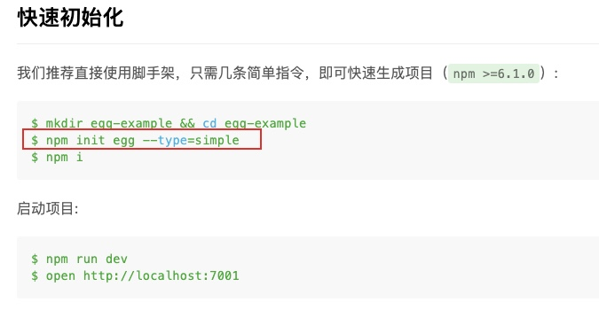

# npm

## npm init

现在很多框架都是直接让你直接使用 npm init <project-command> 来初始化项目，即使这个包本身就没有下载到全局上，也能直接运行该命令

以 eggjs 官方为例

> npm@6 版本引入了 npm-init <initializer> 语法，等价于 npx create-<initializer> 命令，而 npx 命令会去 \$PATH 路径和
> node_modules/.bin 路径下寻找名叫 create-<initializer> 的可执行文件，如果找到了就执行，找不到就去安装。
> 也就是说，npm init egg 会去寻找或下载 create-egg 可执行文件，而 create-egg 包就是 egg-init 包的别名，相当于调用了 egg-init

## [npm ci](https://docs.npmjs.com/cli/v7/commands/npm-ci)

该命令与 `npm install` 类似，不同之处在于该命令适用于自动化环境，例如测试平台，持续集成和部署-或任何您要确保干净安装依赖项的情况。

## npm start

该命令能够和`npm run start` 一样，遵循 [`npm run-script`](https://docs.npmjs.com/cli/v7/commands/npm-run-script)
