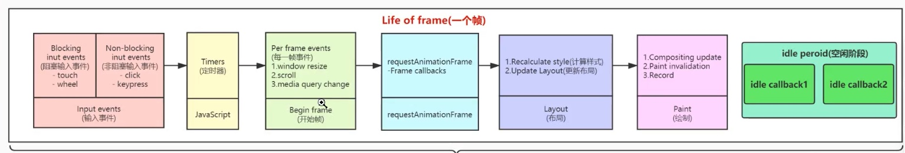

# react fiber

## 屏幕刷新率

-   一般屏幕刷新率 60 次/s 约 16.66 毫秒每帧
-   浏览器渲染动画或页面的每一帧的速率也需要跟屏幕的刷新率保持一致
-   如果低于 60 次/s 那么就会出现卡顿



## raf

[requestAnimationFrame](https://developer.mozilla.org/zh-CN/docs/Web/API/Window/requestAnimationFrame)

回调函数会在绘制之前执行对应的回调。

## requestIdleCallback

[requestIdleCallback](https://developer.mozilla.org/zh-CN/docs/Web/API/Window/requestIdleCallback)

方法将在浏览器的空闲时段内调用的函数排队。这使开发者能够在主事件循环上执行后台和低优先级工作，而不会影响延迟关键事件，如动画和输入响应。函数一般会按先进先调用的顺序执行，然而，如果回调函数指定了执行超时时间 timeout，则有可能为了在超时前执行函数而打乱执行顺序。

```js
function sleep(delay: number) {
    for (const start = Date.now(); Date.now() - start <= delay; ) {
    }
}
// work的每一项都是最小单元，但是我们希望的是每一帧 16ms 中都能执行完
const works: Array<() => void> = [
    () => {
        console.log('第1个任务开始');
        // sleep(200);
        console.log('第1个任务结束');
    },
    () => {
        console.log('第2个任务开始');
        sleep(20);
        console.log('第2个任务结束');
    },
    () => {
        console.log('第3个任务开始');
        // sleep(20);
        console.log('第3个任务结束');
    },
];

window.requestIdleCallback(workLoop, { timeout: 1000 });

function workLoop(deadline) {
    // performUnitOfWork();
    console.log(`本帧的剩余时间为${parseInt(deadline.timeRemaining())}`)
    console.log(deadline.timeRemaining())
    while(( deadline.timeRemaining() > 0 || deadline.didTimeout ) && works.length > 0){
        performUnitOfWork()
    }
    if (works.length > 0) {
        // window.requestIdleCallback(workLoop, { timeout: 1000 });
    }
}

function performUnitOfWork() {
    (works.shift() as () => void)();
}

// 本帧的剩余时间为8
// requestIdeaCallback.tsx:32 8.805
// requestIdeaCallback.tsx:11 第1个任务开始
// requestIdeaCallback.tsx:13 第1个任务结束
// requestIdeaCallback.tsx:16 第2个任务开始
// requestIdeaCallback.tsx:18 第2个任务结束
// 由于第二个任务运行占据已经超过16ms了，所以后面第3个任务不会执行
```

## 单链表
