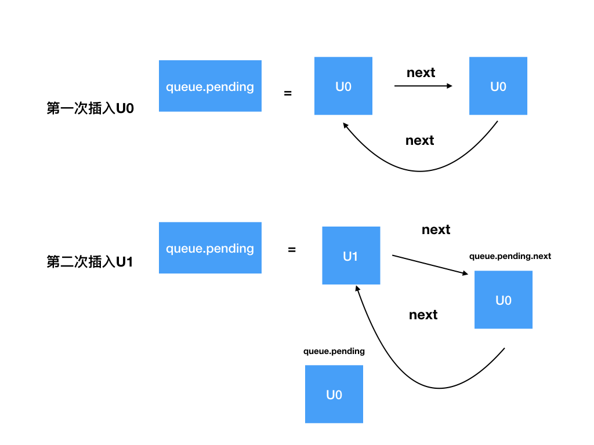

# react-hooks 简单实现


我们简单实现 react-hooks 的基本环境，以 useState 为例。

你能够收获
- hooks 的数据在 react 中是如何通过链表的形式保留下来的。
- 进一步熟悉链表的操作，比如环状链表，单向链表的简单操作。

> 以 const [num,setNum] = useState(0) 为例，每次组件渲染的时候， `useState` 会把上一次的结果都在内部计算出来，而 `setNum` 只是在上一次更新的时候都记录下来并且放到当前hook的链表中。

首先每个组件都有自己对应的 fiber, 并且每个 fiber 存储着自身的节点还有节点一切所使用的 hook，其中 hook 是使用链表串联起来(这也是为什么 hook 不能在条件判断中出现，这样就会有可能导致链表寻找下一个节点失败)，返回一个对象有这一个 `onClick` 的函数，这样做是为了后面验证和调试方便。

```js
const fiber = {
    stateNode:App, // 存储当前节点
    memoizedState:null // 存储一些列 hook
}

function App(){
    const [num,setNum] = useState(0)

    return {
        onClick(){
            setNum(num=>num+1) // useState 的 action 我们先以函数的形式。
        }
    }
}
```

## 运行阶段
支撑我们 app 能运行（刷新）起来需要这个 `schedule` 函数。

```js

const fiber = {
    stateNode:App, // 存储当前节点
    memoizedState:null // 存储一些列 hook
}

function schedule(){
    fiber.stateNode();// 触发组件的render
}
```

不过 `schedule` 仅仅是执行，我们需要区分的是组件是挂载(**mount**) 还是更新(**update**)，所以当第一次执行是 `isMount=true` 当后续继续执行的时候就是 `isMount=false` 代表其实组件更新的状态。

```js
let isMount = true; 

function schedule(){
    fiber.stateNode();// 触发组件的render
    isMount = false;
}
```

另外我们需要全局声明一个变量 `workInProgressHooks` 的指针来指向当前需要运行的hook

```js
let workInProgressHooks = null; // 指向我们当前运行hooks的指针

const fiber = {
    stateNode:App,
    memoizedState:null // 保存对应hooks的数据 
}

function schedule(){
    workInProgressHooks = fiber.memoizedState
   const app =  fiber.stateNode();// 触发组件的render
    isMount = false;
    return app
}
```

以上代码的完整展示
```js
let isMount = true;
let workInProgressHooks = null; // 指向我们当前运行hooks的指针

// 每种组件都有自己对应的fiber节点
const fiber = {
    stateNode:App,
    memoizedState:null // 保存对应hooks的数据 
}

function useState(initialState){
    
}


// 支撑我们mini react-hooks能运行起来需要这个 schedule 函数
function schedule(){
    workInProgressHooks = fiber.memoizedState
   const app =  fiber.stateNode();// 触发组件的render
    isMount = false;
    return app
}

function App(){
    const [num,updateNum] = useState(0)

    return {
            onClick(){
                setNum(num=>num+1)
            }
        }
}

window.app = schedule()
```


## 编写useState

首先我们需要定义一个变量 `hook` 因为 `useState` 可能在一个组件多次调用，那么我们需要用它来找到对应的是哪个 `hook` ,
并且我们需要区分挂载(**mount**) 还是更新(**update**)状态。
- 如果是首次渲染的时候就创建一个 `hook`，利用 `workInProgressHook` 这个变量来记录
- 如果是更新的话就拿取 拿取最新的 `workInProgressHook` 即可

```js
function useState(initialState){
    let hook;
    if(isMount){
        hook = {
          memoizedState:initialState, // 创建的时候对应的 hook 的 memoizedState 就是 initialState
          next:null,
          queue:{
            pending:null // 如果我们调用多次 action 的时候就会把它放进
          }
        }
        if(!fiber.memoizedState){
            fiber.memoizedState = hook; // 如果没有值的话 memoizedState 的第一个就是它
        }else{
            workInProgressHook.next = hook // 在mount 阶段里 组件有多个 useState 的话，需要把每个useState的状态串联起来
        }
        workInProgressHook = hook; // 复制最新的hook
    }else{
        hook  = workInProgressHook //获取最新的hook
        workInProgressHook = workInProgressHook.next; // 更新workInProgressHook的指针，给下一个hook提供最新的状态
    }
    // 剩余的代码 我们先把略过
}
```

## 编写 dispatchAction

`useState` 我们知道它会返回两个值，其中有一个是改变状态的 `action`，最重要的问题是，我们如何辨别当前的`action` 的改变是当前`useState` 的状态呢？

官方通过环状链表来解决，每个 `hook` 都需要绑定一个 `queue` 的链表来连接每次 `update` 的状态。(其中由于存在多个状态更新时候的优先级调度问题)。

接下来我们需要编写 `action` ，作为改变状态的函数，我们定义为 `dispatchAction`, 接受两个值`queue` `action`。

```ts
function dispatchAction(queue, action) {
    // 创建update
    const update = {  // 每次 action 触发的时候
      action,
      next: null
    }
  
    // 环状单向链表操作
    if (queue.pending === null) {
      update.next = update; // 第一就会形成环  u0 -> u0 -> u0 ...
    } else {
      update.next = queue.pending.next; // 注意这里  第二次插入是 u1
      queue.pending.next = update;
    }
    queue.pending = update;
  
    // 模拟React开始调度更新
    schedule();
  }

```



接下来就是回到 `useState` 当每次获取当前最新的 `hook` 的时候需要遍历当前 `hook` 中 `queue`  

```js
function useState(initialState) {
    let hook;

    if (isMount) {
        hook = {
            queue: {
                pending: null
            },
            memoizedState: initialState,
            next: null
        }
        if (!fiber.memoizedState) {
            fiber.memoizedState = hook;
        } else {
            workInProgressHook.next = hook;
        }
        workInProgressHook = hook;
    } else {
        hook = workInProgressHook;
        workInProgressHook = workInProgressHook.next;
    }

    let baseState = hook.memoizedState;
    if (hook.queue.pending) {
        let firstUpdate = hook.queue.pending.next;

        do {
            const action = firstUpdate.action;
            baseState = action(baseState);
            firstUpdate = firstUpdate.next;
        } while (firstUpdate !== hook.queue.pending)

        hook.queue.pending = null;
    }
    hook.memoizedState = baseState;

    return [baseState, dispatchAction.bind(null, hook.queue)];
}
```


## 最后全部完整的代码
```js

let isMount = true;
let workInProgressHook = null; // 指向我们当前运行hooks的指针

// 每种组件都有自己对应的fiber节点
const fiber = {
    stateNode: App,
    memoizedState: null // 保存对应hooks的数据 
}

function useState(initialState) {
    let hook;

    if (isMount) {
        hook = {
            queue: {
                pending: null
            },
            memoizedState: initialState,
            next: null
        }
        if (!fiber.memoizedState) {
            fiber.memoizedState = hook;
        } else {
            workInProgressHook.next = hook;
        }
        workInProgressHook = hook;
    } else {
        hook = workInProgressHook;
        workInProgressHook = workInProgressHook.next;
    }

    let baseState = hook.memoizedState;
    if (hook.queue.pending) {
        let firstUpdate = hook.queue.pending.next;

        do {
            const action = firstUpdate.action;
            baseState = action(baseState);
            firstUpdate = firstUpdate.next;
        } while (firstUpdate !== hook.queue.pending)

        hook.queue.pending = null;
    }
    hook.memoizedState = baseState;

    return [baseState, dispatchAction.bind(null, hook.queue)];
}

function dispatchAction(queue, action) {
    // 创建update
    const update = {
      action,
      next: null
    }
  
    // 环状单向链表操作
    if (queue.pending === null) {
      update.next = update;
    } else {
      update.next = queue.pending.next;
      queue.pending.next = update;
    }
    queue.pending = update;
  
    // 模拟React开始调度更新
    schedule();
  }

// 支撑我们mini react-hooks能运行起来需要这个 schedule 函数
function schedule() {
    workInProgressHook = fiber.memoizedState
    const app = fiber.stateNode();// 触发组件的render
    isMount = false;
    return app
}

function App() {
    const [num, updateNum] = useState(0)

    return {
        onClick() {
            updateNum(num => num + 1)
        }
    }
}

window.app = schedule()

```