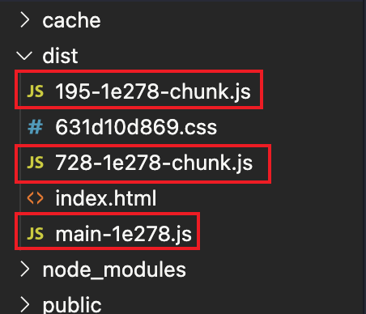
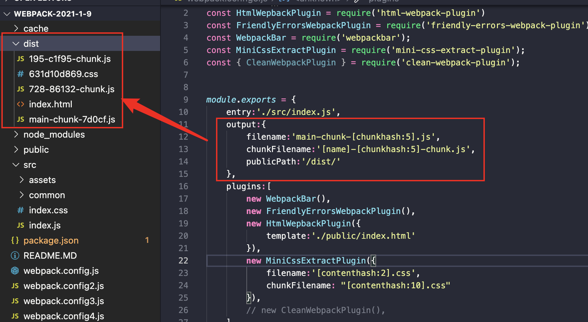
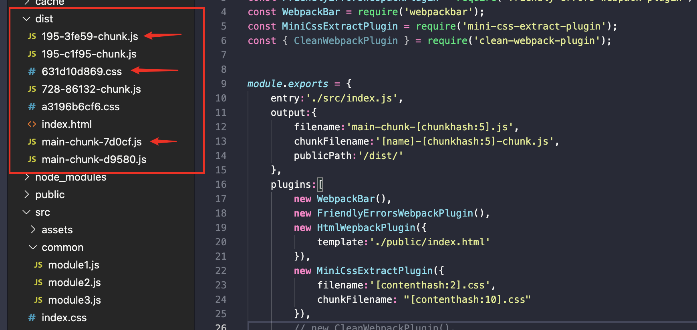
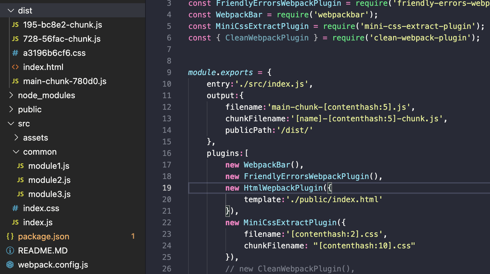
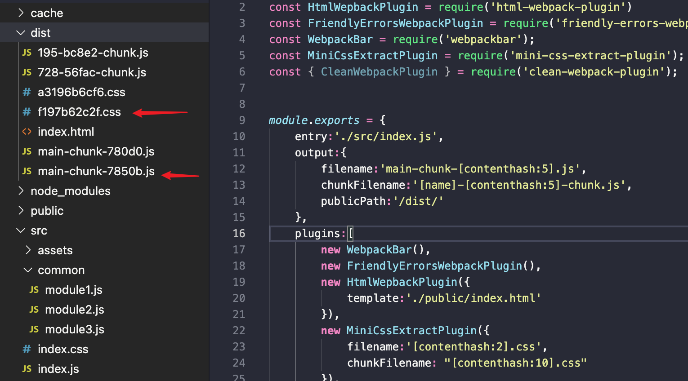

# 关于 webpack 的 文件指纹

[官网地址](https://webpack.docschina.org/concepts/under-the-hood/#chunks)

我们都知道 webpack 的 hash 有三种，分别为 `contenthash` `chunkhash` `hash` 并且这 3 中 hash 的生成方式不同，所以这三种使需要搭配如何长期缓存。

### `hash`

```js
output:{
        filename:'[name]-[hash:5].js',
        chunkFilename:'[name]-[hash:5]-chunk.js',
        publicPath:'/dist/'
    },
```

> `filename` 代表 main-chunk， `chunkFilename` 代表 splitChunk 或者 动态 import 后的模块定义的文件名称。

这样设置的效果会导致所有的模块都有对应 hash 值（下图）



不过只要其中一个代码一处改变，那么打包后的所有文件的 hash **都会发生改变**。

### `chunkhash`

`chunkhash` 基于 webpack 入口点。定义的每个入口都会拥有自己的哈希值。 如果该特定入口点发生任何变化，则**仅相应的哈希值将发生变化**，但是这样会有另外的**问题**，如果我该 chunk 引入了 css 文件，该 css 文件有变动了，但是该 chunk 的 js 代码没有变动，最后的结果是，css 文件和 `chunkhash` 都改变了。

当我们打包的时候是这样的（下图）



当如果我只修改了 css 文件（下图）



那么结果很显然，最后是 `chunkhash` 一起都会被改变，所以在网络上大多数说得人的并不准确。

但是每次 css 不会触发对应的 `chunk` 改变有什么方法呢？ 那么就可以使用 接下来的`contenthash`

### `contenthash`

`contenthash` 是对于每个对应 `chunk` 改变，对应的 `hash` 才会改变，其他 `chunk` 的 `hash` 并没有改变，使用 `contenthash` 能够很好帮助我们配合缓存进行优化 QA



当如果我只修改了 css 文件（下图）



并且在 webpack5 中提供了一个 `optimization.realContentHash` [链接](https://webpack.docschina.org/configuration/optimization/#optimizationrealcontenthash)，当开启后注释的改变和变量名的替换 contenthash 都不会发生改变。

### 结论

1. 在 `output.chunkFilename` 中建议使用 `contenthash` 因为使用这个能够最大限度做缓存策略。
2. webpack5 中 `optimization.realContentHash = true` ，对于 contenthash 进一步优化其功能特性，即使改了注释和变量名也`contenthash` 不会发生改变。
