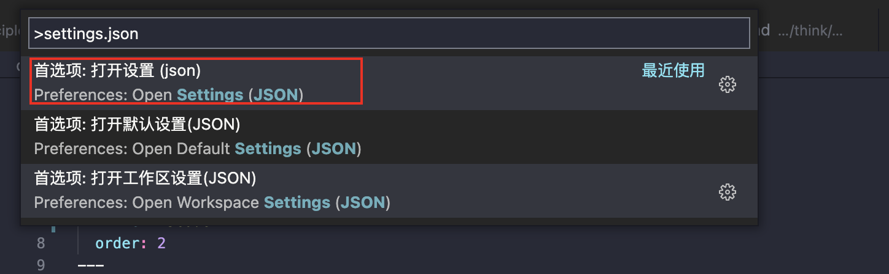
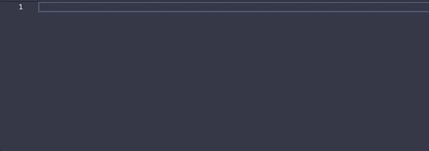

# 提高工作效率的 vscode 配置

在业务开中，我们经常需要和 IDE 打交道，一款利于开发的 IDE 是非常有必要的，本文只介绍当下比较流行 IDE **Visual Studio Code** ，本文介绍 **Visual Studio Code** 中，如何去  配置配置文件以及好用的插件。

## 基础使用

### 快速定位文件

在 vscode 中一个使用频率非常频繁的快捷键 `command + p` or `ctrl + p` 能够快速定位文件位置，类似 webstorm 中的双击`shift`。


### 超级好看的字体

我公司的电脑是 windows，而家里使用的是 mac，每次来回切换的时候看到的字体都不一样，看 mac 看得多了之后，觉得 windows 的字体看起来有点丑，所以我在 github 上找了一个特别有名的字体库，并且是免费的 [FiraCode](https://github.com/tonsky/FiraCode) 。

windows 的用户：

1. 在下载页面中的字体文件 [下载页](https://github.com/tonsky/FiraCode/tree/master/distr/ttf)
2. 然后下载完之后点击对应文件，右键点击安装
3. 打开 vscode 键盘按 `command + shift + p` 然后搜索 `settings.json`（如下图）



4. 点击 settings.json 的按钮，然后
   可以直接填如下即可，详细可以查看[官方设置](https://github.com/tonsky/FiraCode/wiki/VS-Code-Instructions)

```json
"editor.fontFamily": "'Fira Code'",
"editor.fontLigatures": true,
```

### 终端中直接打开 vscode

1. 在终端中直接输入 code 的能够直接打开 vscode

设置步骤：

1. 打开 vscode
2. 键盘按 `command + shift + p` 然后搜索 `shell command`
3. 选择安装即可在全局中安装。

### 自定义 snippet（代码段）

有时候我们编写业务代码都会重复写出很多相同的代码，如果利用这个功能，把每次都需要手动编写的代码能够直接带出来，那么我们的开发效率就会非常高效。

1. 键盘按`command + shift + p` 然后输入 `snippets` 点击进入用户代码片段配置
2. 然后选择你的目标代码文件类型，比如：我选择 javascript(React)

打开之前是这样

```json
{
    // Place your snippets for javascriptreact here. Each snippet is defined under a snippet name and has a prefix, body and
    // description. The prefix is what is used to trigger the snippet and the body will be expanded and inserted. Possible variables are:
    // $1, $2 for tab stops, $0 for the final cursor position, and ${1:label}, ${2:another} for placeholders. Placeholders with the
    // same ids are connected.
    // Example:
    // "Print to console": {
    // 	"prefix": "log",
    // 	"body": [
    // 		"console.log('$1');",
    // 		"$2"
    // 	],
    // 	"description": "Log output to console"
    // }
}
```

输入对应模板代码后

```json
{
    // Place your snippets for javascriptreact here. Each snippet is defined under a snippet name and has a prefix, body and
    // description. The prefix is what is used to trigger the snippet and the body will be expanded and inserted. Possible variables are:
    // $1, $2 for tab stops, $0 for the final cursor position, and ${1:label}, ${2:another} for placeholders. Placeholders with the
    // same ids are connected.
    // Example:
    "Print to console": {
        "prefix": "my-log",
        "body": ["console.log('$1');"]
        // 	"description": "Log output to console"
    }
}
```

那么我们直接在 jsx 的文件中直接输入 `my-log` 就能带出（如下图）



那么我们就可以编写对应的插入式的模板，不过你可能好奇 `$1` 是哪里来, 为什么光标就停留在里面, 对于模板里面的环境变量可以参考这篇文章 [链接](https://blog.csdn.net/maokelong95/article/details/54379046)

## 插件推荐

官方统计比较流行的插件集[链接](https://marketplace.visualstudio.com/search?target=VSCode&category=All%20categories&sortBy=Installs)

### Debugger for Chrome

能够在 vscode 中调试项目代码，而不需要写 `debugger` 在 chrome 中调试。

### Code Runner

能够在 vscode 中编译且运行各种类型文件

### [Path Intellisense](https://marketplace.visualstudio.com/items?itemName=christian-kohler.path-intellisense)

可自动填充文件名。

### [filesize](https://marketplace.visualstudio.com/items?itemName=mkxml.vscode-filesize)

在状态栏中显示当前文件大小，点击后还可以看到详细创建、修改时间

### [Indent-Rainbow](https://marketplace.visualstudio.com/items?itemName=oderwat.indent-rainbow)

用四种不同颜色交替着色文本前面的缩进

### [guides](https://marketplace.visualstudio.com/items?itemName=spywhere.guides)

显示代码对齐辅助线，很好用

### [Code Spell Checker](https://marketplace.visualstudio.com/items?itemName=streetsidesoftware.code-spell-checker)

代码拼写检查器
一个与 camelCase 代码配合良好的基本拼写检查程序。
此拼写检查程序的目标是帮助捕获常见的拼写错误，同时保持误报数量较低。

### [Atuo Rename Tag](https://marketplace.visualstudio.com/items?itemName=formulahendry.auto-Rename-tag)

修改 html 标签，自动帮你完成头部和尾部闭合标签的同步修改

### [Auto Close Tag](https://marketplace.visualstudio.com/items?itemName=formulahendry.auto-close-tag)

编写 html 标签，自动帮你完填充尾部的标签

### [beautify](https://marketplace.visualstudio.com/items?itemName=HookyQR.beautify)

格式化代码工具

美化 javascript，JSON，CSS，Sass，和 HTML 在 Visual Studio 代码。

### [File Utils](https://marketplace.visualstudio.com/items?itemName=sleistner.vscode-fileutils)

对文件或文件夹方便快捷地增删改

### [Trailing Spaces](https://marketplace.visualstudio.com/items?itemName=shardulm94.trailing-spaces#user-content-installation)

高亮那些冗余的空格，可以快速删掉。
