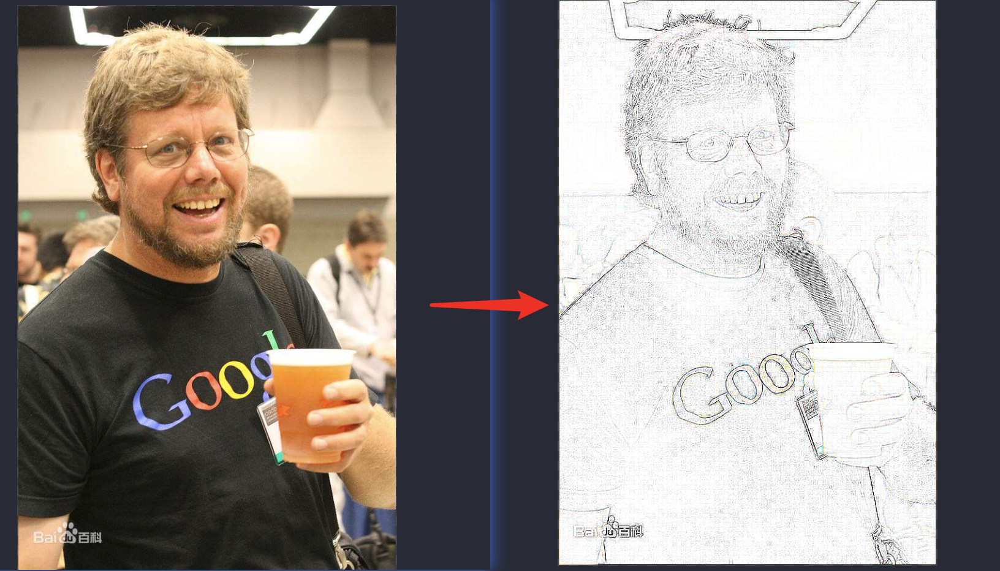

## python 语言的诞生

[Guido van Rossum](https://baike.baidu.com/item/%E5%90%89%E5%A4%9A%C2%B7%E8%8C%83%E7%BD%97%E8%8B%8F%E5%A7%86/328361?fromtitle=Guido%20van%20Rossum&fromid=3225314&fr=aladdin)，Python 语言创立者，20 世纪 90 年代初诞生，2002 年 python 2.x，2008 年 python 3.x


## python 优势

-   代码简洁(不需要声明变量，当赋值的瞬间变量已经分配好对应内存)
-   可读性好
-   开源+跨平台 (https://pypi.org/)

如何启动？

1. 配置好环境变量之后，在命令行 输入`python`，就可以进入环境。
2. 命令行输入 `python xxx.py` 来执行对应文件。
3. 通过 IDLE。（使用 pc 或者 anachonda）

## 安装

1. 到 Python [主页](https://www.python.org/)下载并且安装 基本开发和运行环境。（建议自定义安装自己方便查找的目录）
2. 根据操作系统不同选择不同版本。
3. 下载响应的 Python 3.0 系列版本程序。

## Abaconda 中添加环境

```bash
# 创建对应的环境
conda create -n test python=3.7
```

```bash
# 激活对应的环境
activate test
```

在 anaconda 中使用刚刚添加的 `test` 环境，然后在面板中选择 `sypder` 然后下载 `3.3.4` 版本，因为使用这个来前期过渡学习 python 这门语言会比较友好，能够逐行解析,如果选择 4 版本基本和 `pc` 差不多了，还不如用 pc。

## 小 demo 直接上手

能够直接把相片直接转换

```py
from PIL import Image;
from PIL import ImageFilter

im = Image.open('pic.jpeg') # 当前本地的相片
contour = im.filter(ImageFilter.CONTOUR)
contour.save('pic2.jpeg')  # 转化后的相片
```

<br/>


## python 部分词法

### python 的格式框架

该语言采用严格的 `缩进` 来表明程序的格式框架。缩进指每一行代码开始前的空白区域，用来表示代码之间的包含和层次关系。

一个缩进（Tab）= 4 个空格（space）,按住 `shift` + `tab` 还原。

```py
name = 'mingzai'
if name == 'xiaoming':
  print('我是小明')
else:
  print('我是明仔')
```

### 引号

可以使用单引号和双引号，而且单引号可以嵌套双引号或者双引号嵌套单引号。

```py
print("Hellow world")
print('Hellow world')

print('Hellow world "a"')
print("Hellow world 'a'")
```

### 注释

```py
# 单行注释

'''
  多行注释
'''
```

### Python 中文编码

```py
# -*- coding: utf-8 -*-
```

-   常见的编码格式：GBK
-   常见的编码格式：utf-8

### 标识符命名

-   常量：程序中补发生改变的元素。
-   变量：程序中值发生改变或者可以发生改变的元素。

Python 语言允许采用 **大写字母**，**小写字母**，**数字**，**下划线(\_)和汉字**等字符及其组合给变量命名，但名字的首字符不能是数字，中间不能出现空格，长度没有限制。

> 注意：标识符对 **大小写敏感**，python 和 Python 是两个不同的名字。

### 保留字

-   保留字，也称为关键字，指被编程语言内部定义并保留使用的标识符。
-   程序员不能定义与保留字相同的标识符（变量）。
-   每种程序设计语言都有一套保留字，保留字一般用来构成程序整体框架，表达关键值和具有结构性的复杂语义等。
-   掌握一门编程语言首先要熟记及其对应的保留字。

|          |        |          |
| -------- | ------ | -------- |
| and      | as     | assert   |
| break    | class  | continue |
| def      | del    | elif     |
| else     | except | finally  |
| for      | from   | False    |
| global   | if     | import   |
| in       | is     | lambda   |
| nonlocal | not    | None     |
| or       | pass   | raise    |
| return   | try    | True     |
| while    | with   | yield    |

### 保留值

type 函数

```py
type('a') # <class 'str'>
```

True & False 类型

```py
 True === 1
 False === 0
 # 虽然它们的比较是相同，但是它们的类型不相同
```

None 类型

-   None 是一个非常特殊的**常量**。
-   None 和 False 不相同。
-   None 不是 0。
-   None 不是空字符串。
-   None 有自己的数据类型 NoneType。

> 你可以将 None 赋值给任何变量，但是你不能创建其他 NoneType 对象。

help 函数

help 可以用来查看任意数据的信息。

```py
help(None) # 能够查看内部对应的构建函数
```

## Python 基本数据类型

-   数字
-   布尔
-   NoneType
-   组合数据类型
    -   序列
        -   字符串
        -   元祖
        -   列表
    -   集合
    -   字典

> Python 不需要声明数据类型，但是你不能直接单独写一个 a，需要写成 `a = None`

### 数字

-   整数类型
    -   与数学中的证书概念一致，没有**取值**范围限制
    -   0x7a, -0x29 (0x 开头表示 16 进制) --- hex 函数（转化为 16 进制）
    -   0o123, -0o456 (0o 表示 8 进制) ----- oct 函数（转化为 8 进制）
    -   0b010, -0b101 (ob 开头是 2 进制)----- bin 函数（转化为 2 进制）
-   浮点类型
    -   IEEE 754 标准
-   复数类型

```py
a = 3
b = 2.3
c = 3 + 4j
```

```py
pow(x,y) #函数：计算x的y次方
pow(2,10) #1024
```

### 内建函数 id

用内建函数 `id()` 可以查看每个对象的内存地址，即身份。

```py
    id(3) # 4488639680
    a = 3
    b = 4
    id(a) # 4488639680
```

### 浮点型类型

-   带有小数点即小数的数字
-   Python 语言中浮点数的数值**范围存在限制**，**小数精度也存在限制**。这种限制在不同计算机系统有关。
-   科学计数法，'e' 或 ’E‘ 作为幂的符号，以 10 为基数，如：**9e4 = 90000.0**，**4.1e-2 = 0.041**

### 复数类型

-   z = 1.24e-5 （实部和虚部是什么？）
-   对于复数 z ，可以用 z.real 获得实数部分，z.imag 获得虚数部分
-   z.real = 1.24e-0.5 z.imag = 39

### 数字类型操作

-   三种类型存在一种逐渐扩展的关系：**整数（a = 2) -> 浮点数(a = 2.5) -> 复数(a = 2.5 + 4j)**
-   不同数字类型之间可以进行混合运算，运算后生成结果为**最宽类型**
-   123 + 4.0 = 127.0 （整数 + 浮点数 = 浮点数）

```py
3/2 # 1.5
100 // 24 # 4 ->整除的意思
```

| 操作符   | 描述                                            |
| -------- | ----------------------------------------------- |
| x + y    | x 于 y 之和                                     |
| x - y    | x 于 y 之差                                     |
| x \* y   | x 于 y 之积                                     |
| x / y    | x 于 y 之商                                     |
| x // y   | x 于 y 之整数商，即：不大于 x 与 y 之商最大整数 |
| x % y    | x 于 y 之商余数，也称为模运算                   |
| -x       | x 的负数                                        |
| +x       | x 本身                                          |
| x \*\* y | x 的 y 次幂                                     |

### 内置数值运算函数

| 函数                | 描述                                                             |
| ------------------- | ---------------------------------------------------------------- |
| abs(x)              | x 的绝对值                                                       |
| divmod(x,y)         | (x//y,x%y),为输出二元组形式（也称元祖类型）                      |
| pow(x，y[,z])       | (x**y)%z [...]表示该参数可以省略，即：pow(x,y)，它与 x ** y 相同 |
| round(x,[,ndigits]) | 对 x 四舍五入，保留 ndigits 位小数。round(x)返回四舍五入的整数值 |
| max(x1,x2,x3...,xn) | x1,x2,x3...xn 的最大值                                           |
| min(x1,x2,x3,xn)    | x1,x2,x3...xn 的最小值，n 没有限定                               |

### 类型转换

| 函数             | 描述                                                                                                    |
| ---------------- | ------------------------------------------------------------------------------------------------------- |
| int(x,base)      | 将 x 转化为整数，x 可以是浮点数或字符串，base 存在时，视 x 为 base 类型数字，并将其转换为 10 进制数字。 |
| float(x)         | 将 x 转换为浮点数，x 可以是整数或字符串                                                                 |
| complex(re[,im]) | 生成一个复数，实部为 re ，虚部为 im ，re 可以是整数 浮点数或字符串，im 可以是整数或浮点数但不能为字符串 |
| bool(x)          | 将 x 转换为 bool 值（True 或者 Flase）x 可以是数字类型也可以其他类型                                    |

### 字符串

> **图像，声音**都是用数字来存放
>
> **文本**都是使用字符串存放

-   单引号和双引号都能接受

```py
    a = 'b'
    a = "b"
```

-   Python 语言转义符：`\`
-   输出带有引号的字符串，可以使用转义符
-   使用 `\\` 输出带有转义符的字符串
-   单个索引辅助访问字符串中的**特定位置**

```py
>>> a = 'abc'
>>> a[2]
'c'
```

-   字符串索引还可以访问**负数**位置

```py
>>> a = 'abc'
>>> a[-1]
'c'
```

-   切片操作
    -   可以通过两个索引值确定一个位置范围，返回这个范围的子串格式：`<string>[<start>:<end>]`
    -   **start** 和 **end** 都是整数型数值，这个子序列从索引 **start** 开始到 索引 **end** 结束，但不包括 **end** 位置。

```py
>>> a = 'abcdefg'
>>> a[0:1]
'a'
>>> a[0:2]
'ab'
>>> a[0:-2]
'abcde'
>>> a[:-2]
'abcde'
>>> a[0:]
'abcdefg'
>>> a[:]
'abcdefg'
```

-   字符串之间可以通过 + 或 \* 进行连接
    -   **加法操作** (+) 将两个字符串连接成为一个新的字符串
    -   **减法操作** (-) 生成一个由本身字符串重复连接而成的字符串

```py
>>> a = 'abc'
>>> b = 'efg'
>>> a+b
'abcefg'
>>> a*2
'abcabc'
```

### 赋值语句

-   `=` 表示“赋值”，等号右侧的值计算后将结果赋给左侧变量
-   同步赋值语句：同事给多个变量赋值

```py
    a,b = 1,2
```

### input()函数

-   获得用户输入之前，input()函数可以包含一些提示性文字
-   input 函数会把输入的数据传给左边的变量来保存，2.7 版本中该变量是数字类型。3.x 版本当中是字符串类型

```py
input('请输入：')
请输入：xxx
output: xxx
```

### eval()函数

-   eval(<\string>) 函数式 Python 语言中一个十分重要的函数，它能够以 Python 表达式的方式解析并执行字符串，将返回结果输出。

```py
a = 1
b = 2
eval("a+b") # 3
```

### print 函数

-   不带回车：

```py
print('没有回车',end='');print('没有回车2',end='')
# 没有回车没有回车
print('有回车');print('有回车')
# 有回车
# 有回车
```

-   格式化输出：

```py
    s = 'wenhaoming'
    x = len(s)
    print('the length of %s is %d'%(s,x))
    # the length of wenhaoming is 10
```

-   拼接输出：

```py
    a = 10
    print('Number is',a)
    # Number is 10
```

### 正反斜杠

-   正斜杠 `/`:除法运算，相对路径
-   反斜杠 `\`:转义字符，绝对路径

## 内置函数

### len()

`len()`函数能否返回一个字符串的长度

```py
>>> a = 'abcd'
>>> len(a)
4
```

### str()

大多数数据类型都可以通过 `str()` 函数转换为字符串

```py
>>> str(True)
'True'
>>> str(123)
'123'
>>> str(25e4)
'250000.0'
```

### for...in 组成的循环来遍历字符串中每个字符

for <var> in <\string|array>:

```py
a = [1,2,3,4]
for b in a:
    print(b)
1
2
3
4
```

### 字符串 ljust, rjust

`ljust()`, `rjust()` 方法返回一个原字符串左（右）对齐，并使用空格填充至指定长度的新字符串。如果指定的长度小于原字符串的长度则返回源字符串。

```py
>>> 'abcd'.rjust(20)
'                abcd'
>>> 'abcd'.ljust(20)
'abcd                '
>>> 'abcd'.ljust(20,"*")
'abcd****************'
```

### 字符串处理函数

-   `<string>.upper()` 字符串中字母大写
-   `<string>.lower()` 字符串中字母小写
-   `<string>.strip()` 去两边空格或指定字符
-   `<string>.split()` 指定字符分割为数组

```py
>>> '  abc  '.strip()
'abc'
>>> '1111abc11'.strip('1')
'abc'
>>> ' 1111abc11 '.strip('1')
' 1111abc11 '
```

## 练习

-   查看变量类型的 Python 内置函数是\_\_\_。
-   查看内存地址的 Python 内置函数是\_\_\_。
-   表达式 int('123',16) 的值是\_\_\_。
-   表达式 ':'.join('abcdefg'.split('cd')) 的值是\_\_\_。
-   表达式 len('abcdefg'.ljust(3)) 的值是\_\_\_。

答案：

-   type()
-   id()
-   291
-   ab:efg
-   7
