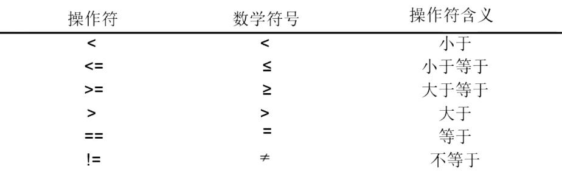
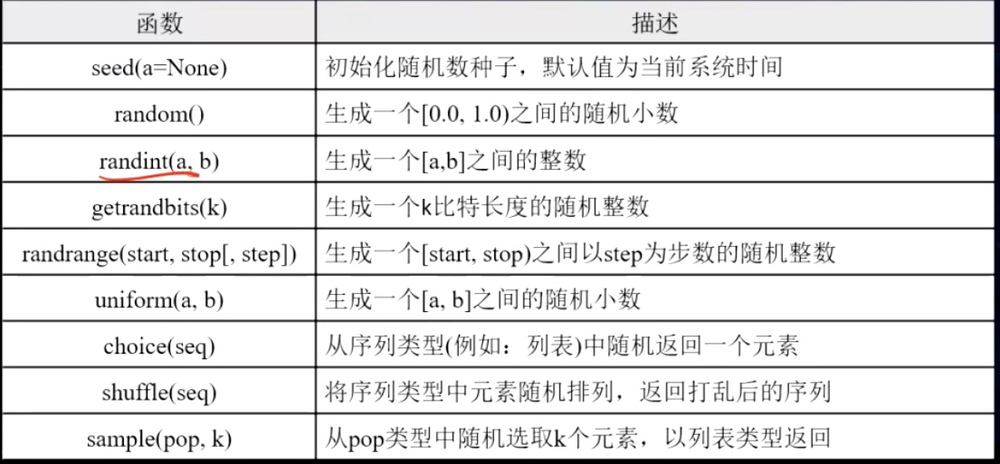

# Python 控制结构

## 分支结构

```py
a = 2
if a == 1:
    print('a == 1')
elif a == 2:
    print('a == 2')
else:
    print('a~~')
```

## 关系操作符



## Python 中浮点数的比较

**Javascript** 和 **Python** 一样遵循着 [iEEE754](https://baike.baidu.com/item/IEEE%20754/3869922?fr=aladdin)

就是 0.1 和 0.2 转换二进制的时候都是无穷无尽的，按照 iEEE754 的规则下，浮点数的实际值，等于**符号位（sign bit）乘以指数偏移值(exponent bias)再乘以分数值(fraction)**

那么浮点数如何在精度存在误差的时候进行比较呢？

-   做差绝对值下和最小的值比较
-   `math.isclose` 方法

```py
a = 0.1 + 0.2

abs(a-0.3) < 0.000001

import math

math.isclose(a,0.3)
```

## 多条件语句

Python 支持 `and`：&（且） `not`：!（非）`or`：|（或）

```py
a = 3

a > 2 and a < 4 # True

5 > a > 2

2 < a < 5

2 < a > 5

not True # False

a =  1 or 2 # 1

a = 1 and 2 # 2
```

## 分支结构单行表示

分支结构还有一种更简洁的表达，适合通过判断返回特定值（类似 js 的三目运算符）语法格式如下：

`<表达式> if <条件> eles <表达式2>`

```py
'存在' if -1>0 else '没有' # 没有
```

## for 语句

遍历循环（知道循环次数用 for，不知道用 while）
遍历结构可以是 字符串，组合数据类型 或 range() 函数

```py
for <循环遍历> in <遍历结构>:
    <语句块>
else:
    <语句块>
```

## while 循环

while 实现无限循环

```py
while <条件>:
    <语句块>
else:
    <语句块>
```

## range 函数

range() 是一个计数函数，实现循环从一个数字开始计数到另一个数字，一旦到达最后的数字或某个条件不再满足就立刻退出循环。

range(start, end, step = 1)

range 不会声明一大堆的内存空间，一直都一个，用完一个又一个。
list 可以 接受 range

```py
list([0,1,2,3,4,5,6,7,8,9])
list(range(10))
```

## 循环保留关键字

-   `break` 跳出循环
-   `return` 跳出循环
-   `continue` 跳出当前循环

## enumerate 枚举函数

枚举函数 enumerate() 用于将序列对象转换为一个索引序列，并返回序列对象的索引和成员，一般在 for 循环中得到序列对象的**索引**和**序列对象成员**。使用枚举函数迭代序列对象的语法：

```py
list = ['a','b','d']
for index, iter_var in enumerate(list,start_index = 0):
```

## zip 函数

zip 函数接收任意多个（包括 0 个和 1 个）序列作为参数，返回一个 tuple 列表。

```py
names = ['小明','小红']
ages = [12,19]
for name,age in  zip(names,ages):
    print('{}今年{}'.format(name,age))
```

## reversed 函数

```py
list(reversed(range(10)))
```

## random 库

-   random 库 是 Python 中用于生成随机数的函数库
-   这个库提供了不同类型的随机数函数，所有函数都是基于最基本的 random.random()的函数扩展而来。



[详细链接](https://www.cnblogs.com/liangmingshen/p/8909376.html)

## 蒙特卡洛采样法

随着计算机的出现，数学家找到了另类求解 π 的另类方法：蒙特卡洛方法，又称随机抽样或者统计试验方法
