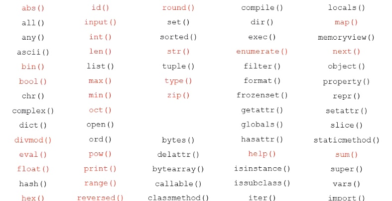

# Python 控制结构

## 分支结构

```py
a = 2
if a == 1:
    print('a == 1')
elif a == 2:
    print('a == 2')
else:
    print('a~~')
```

## 关系操作符


## Python 中浮点数的比较

**Javascript** 和 **Python** 一样遵循着 [iEEE754](https://baike.baidu.com/item/IEEE%20754/3869922?fr=aladdin)

就是 0.1 和 0.2 转换二进制的时候都是无穷无尽的，按照 iEEE754 的规则下，浮点数的实际值，等于**符号位（sign bit）乘以指数偏移值(exponent bias)再乘以分数值(fraction)**

那么浮点数如何在精度存在误差的时候进行比较呢？

-   做差绝对值下和最小的值比较
-   `math.isclose` 方法

```py
a = 0.1 + 0.2

abs(a-0.3) < 0.000001

import math

math.isclose(a,0.3)
```

## 多条件语句

Python 支持 `and`：&（且） `not`：!（非）`or`：|（或）

```py
a = 3

a > 2 and a < 4 # True

5 > a > 2

2 < a < 5

2 < a > 5

not True # False

a =  1 or 2 # 1

a = 1 and 2 # 2
```

## 分支结构单行表示

分支结构还有一种更简洁的表达，适合通过判断返回特定值（类似 js 的三目运算符）语法格式如下：

`<表达式> if <条件> eles <表达式2>`

```py
'存在' if -1>0 else '没有' # 没有
```

## for 语句

遍历循环（知道循环次数用 for，不知道用 while）
遍历结构可以是 字符串，组合数据类型 或 range() 函数

```py
for <循环遍历> in <遍历结构>:
    <语句块>
else:
    <语句块>
```

## while 循环

```py
while <条件>:
    <语句块>
else:
    <语句块>
```

## range 函数

range() 是一个计数函数，实现循环从一个数字开始计数到另一个数字，一旦到达最后的数字或某个条件不再满足就立刻退出循环。

range(start, end, step = 1)

range 不会声明一大堆的内存空间，一直都一个，用完一个又一个。
list 可以 接受 range

```py
list([0,1,2,3,4,5,6,7,8,9])
list(range(10))
```

## 循环保留关键字

-   `break` 跳出循环
-   `return` 跳出循环
-   `continue` 跳出当前循环

## enumerate 枚举函数

枚举函数 enumerate() 用于将序列对象转换为一个索引序列，并返回序列对象的索引和成员，一般在 for 循环中得到序列对象的**索引**和**序列对象成员**。使用枚举函数迭代序列对象的语法：

```py
list = ['a','b','d']
for index, iter_var in enumerate(list,start_index = 0):
```

## zip 函数

zip 函数接收任意多个（包括 0 个和 1 个）序列作为参数，返回一个 tuple 列表。

```py
names = ['小明','小红']
ages = [12,19]
for name,age in  zip(names,ages):
    print('{}今年{}'.format(name,age))
```

## reversed 函数

```py
list(reversed(range(10)))
```

## random 库

-   random 库 是 Python 中用于生成随机数的函数库
-   这个库提供了不同类型的随机数函数，所有函数都是基于最基本的 random.random()的函数扩展而来。


[详细链接](https://www.cnblogs.com/liangmingshen/p/8909376.html)

## 蒙特卡洛采样法

随着计算机的出现，数学家找到了另类求解 π 的另类方法：蒙特卡洛方法，又称随机抽样或者统计试验方法

# 程序的异常处理

## try-except

最好把所有预料到的 typeError 都写出来,

```py
try:
    num = eval(input('请输入一个整数：'))
    print(num**2)
except NameError:
    print('输入错误，请输入一个整数')
except:
    print('未知类型错误')
else:
    print('输入正确')
finally:
    print('怎么样都会走到这里')
```

捕捉错误信息，可以在后面跟 as xxx

```py
try:
    num = eval(input('请输入一个整数：'))
    print(num**2)
except NameError as msg:
    print('输入错误，请输入一个整数',msg)
except:
    print('未知类型错误')
else:
    print('输入正确')
finally:
    print('怎么样都会走到这里')
```

主动抛出错误

关键字 raise expection

```py
try:
    num = eval(input('请输入一个整数：'))
    print(num**2)
    raise Exception # 主动报错，但是不会走到 NameError
except NameError as type:
    print('输入错误，请输入一个整数',type)
except:
    print('未知类型错误')
else:
    print('输入正确')
finally:
    print('怎么样都会走到这里')
```

## 练习：

1. 允许用户最多尝试 3 次，3 次都没猜对的话，就直接退出，如果猜对了，打印恭喜并退出，如果没猜对，打印很遗憾！

```py
for nun in range(3):
    try:
        age = input('请输入数字年龄：')
        if int(age) !=  18:
            print('很遗憾没猜对')
            continue
        else:
            print('恭喜你猜对了')
            break
    except:
        print('请输入正确的类型')

```

2. 要求使用 try...except...else...finally 编写一个用户密码输入程序，要求全部为数字，要求长度 8 位，不符合要求时抛出异常，可以用 raise 方法

```py
try:
    account = eval(input('请输入账号'))
    password = eval(input('请输入密码'))
    if not(type(account) is int and type(password) is int ):
        raise TypeError('账号或密码须为数字')
    elif not(len(str(account)) == 8 and len(str(password)) == 8):
        raise ValueError('账号或密码长度必须为8位')
except TypeError as msg:
    print(msg)
except ValueError as msg:
    print(msg)
except:
    print('未知类型')
else:
    print('输入正确')
finally:
    print('退出')
```

## 函数的定义

```py
def<函数名>(<参数列表>):
    <函数体>
```

1. 参数可以存在默认值

```py
def repeat(str=''):
    print(str)

repeat()
```

2. 可变数量参数

不确定有多少个参数的情况下,\*是一个元祖，但是携带\*的参数是一个元祖

```py
def func(x,*y):
    print(x,max(y)) # y 是一个元祖(1,2,3)

func(1,2,3,4,5)
```

3. 传参时扩展，类似 js 的扩展运算符

```py
def func2(x,*y):
    print(x,*y)

func2(*(1,2,3)) # 1 (2, 3)
func2((1,2,3)) # (1, 2, 3)
```

4. 函数充当参数

```py
def func3(fun):
    return fun()
def func():
    print('func4')
func3(func)
```

5. 多个返回值

```py
def move(x,y):
    return x,y
resX,resY = move(1,2)
print(resX,resY)
```

6. 函数嵌套

```py
def fn1():
    def fun2():
        return
    def fun3():
        return
    def fun4():
        return
    return
```

## 全局变量和局部变量

在函数内部的变量都是局部,如果需要修改全局的数据 需要使用关键字 `global` 去声明

```py
sideNum = 1
def sideNumFn():
        print(sideNum) # 1
sideNumFn()

def func5():
    global sideNum
    sideNum = 2

func5()
print(sideNum) # 2
```

练习：

```py
x = 1
def func1():
    x = 2
    print('局部变量',x) # 2
    def func2():
        global x
        x = 3
        print('全局变量x',x) # 3
    func2()
    print('func1最后x',x) # 2
print(x) # 1
func1()
print(x) # 3
```

## lambda 函数

-   Python 语言特有的简洁函数模型
-   Python 学习中**极为重要**一环
-   一个合作 Python 工程师一定会善用 lambda 函数

```py
c = lambda x,y,z:x+y+z

print(c(1,2,3))
```

## map()和 lambda 函数的组合使用

第一个参数 function 以参数序列中的每一个元素调用 function 函数，返回包含每次 function 函数返回值的新列表。

```py
def sq(x):
    return x*x
map1 =  map(sq,[y for y in range(5)])
map2 =  map(lambda x:x*x ,[y for y in range(5)])

print(*map1)
```

练习 1：

```py
sentence = 'Welcome To Beijing!'

words = sentence.split() # 728

lengths = map(lambda x:len(x),words)

print(list(lengths)) # 7 2 8
```

练习 2：

```py
A = [1,2,3,4]
B = [5,6,7,8]

print(list(map(lambda x,y:x+y,A,B))) # [6, 8, 10, 12]
```

## python 内置函数

[官方文档](https://docs.python.org/zh-cn/3.7/library/functions.html)



## Python 迭代器

Python 中，任意对象，只要定义了 _NEXT_ 方法，它就是一个迭代器。因此，Python 中的内容如列表，元祖，字典，集合，字符串等组合数据类型都可以被称作迭代器。

可迭代对象就是：实现了迭代器协议的对象。

```py
for i in [1,2,3,4]:
    print(i)
```

### Python 生成器

[彻底理解生成器](https://www.cnblogs.com/liangmingshen/p/9706181.html)
[python 生成器到底有什么优点？](https://www.zhihu.com/question/24807364)

常规函数定义，但是，使用 `yield` 语句而不是使用 `return` 语句返回结果。`yield` 语句执行一次返回一个结果，在每个结果之间函数处于挂起状态，以便重启的时候继续执行。

表示式：类似于列表推导，但是生成器返回按需产生结果的一个对象，而不是构建一个结果列表

```py
gensquares = (x*2 for x in range(5))

def gensquares2(x):
    for i in range(x):
        yield i *2

for i in gensquares:
    print(i,'++')
```
