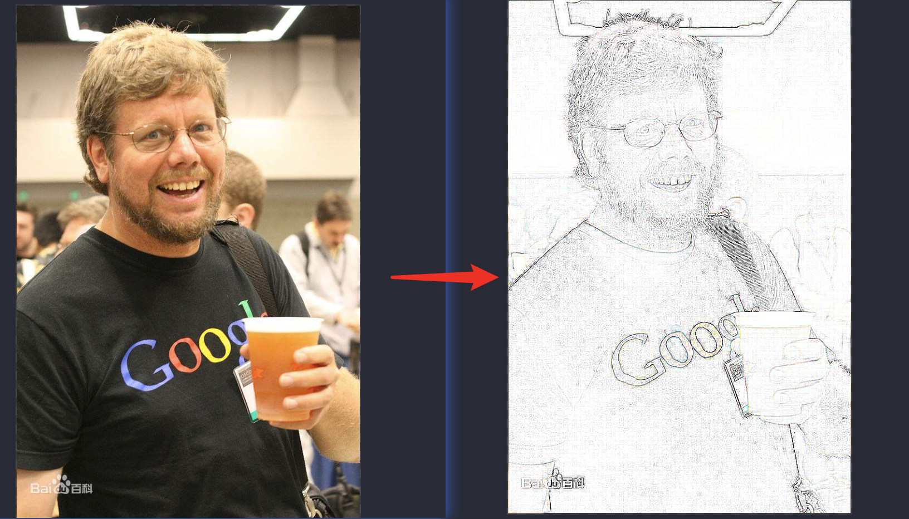

# python 语言的诞生

[Guido van Rossum](https://baike.baidu.com/item/%E5%90%89%E5%A4%9A%C2%B7%E8%8C%83%E7%BD%97%E8%8B%8F%E5%A7%86/328361?fromtitle=Guido%20van%20Rossum&fromid=3225314&fr=aladdin)，Python 语言创立者，20世纪90年代初诞生，2002年 python 2.x，2008年 python 3.x


## python 优势

- 代码简洁(不需要声明变量，当赋值的瞬间变量已经分配好对应内存)
- 可读性好
- 开源+跨平台 (https://pypi.org/)

如何启动？

1. 配置好环境变量之后，在命令行 输入`python`，就可以进入环境。
2. 命令行输入 `python xxx.py` 来执行对应文件。
3. 通过 IDLE。（使用 pc 或者 anachonda）

## 安装

1. 到 Python [主页](https://www.python.org/)下载并且安装 基本开发和运行环境。（建议自定义安装自己方便查找的目录）
2. 根据操作系统不同选择不同版本。
3. 下载响应的 Python 3.0 系列版本程序。

## Abaconda 中添加环境

```bash
# 创建对应的环境
conda create -n test python=3.7
```
```bash
# 激活对应的环境
activate test
```

在 anaconda 中使用刚刚添加的 `test` 环境，然后在面板中选择 `sypder` 然后下载 `3.3.4` 版本，因为使用这个来前期过渡学习 python 这门语言会比较友好，能够逐行解析,如果选择4版本基本和 `pc` 差不多了，还不如用 pc。


## 小demo 直接上手

能够直接把相片直接转换
```py
from PIL import Image;
from PIL import ImageFilter

im = Image.open('pic.jpeg') # 当前本地的相片
contour = im.filter(ImageFilter.CONTOUR)
contour.save('pic2.jpeg')  # 转化后的相片
```
<br/>


## python 部分词法

### python 的格式框架

该语言采用严格的 `缩进` 来表明程序的格式框架。缩进指每一行代码开始前的空白区域，用来表示代码之间的包含和层次关系。

一个缩进（Tab）= 4个空格（space）,按住 `shift` + `tab` 还原。

```py
name = 'mingzai'
if name == 'xiaoming':
  print('我是小明')
else:
  print('我是明仔')
```

### 引号

可以使用单引号和双引号，而且单引号可以嵌套双引号或者双引号嵌套单引号。

```py
print("Hellow world")
print('Hellow world')

print('Hellow world "a"')
print("Hellow world 'a'")
```

### 注释

```py
# 单行注释

'''
  多行注释
'''
```

### Python 中文编码

```py
# -*- coding: utf-8 -*-
```

- 常见的编码格式：GBK
- 常见的编码格式：utf-8


### 标识符命名

- 常量：程序中补发生改变的元素。
- 变量：程序中值发生改变或者可以发生改变的元素。

Python语言允许采用 **大写字母**，**小写字母**，**数字**，**下划线(_)和汉字**等字符及其组合给变量命名，但名字的首字符不能是数字，中间不能出现空格，长度没有限制。

> 注意：标识符对 **大小写敏感**，python 和 Python 是两个不同的名字。

### 保留字

- 保留字，也称为关键字，指被编程语言内部定义并保留使用的标识符。
- 程序员不能定义与保留字相同的标识符（变量）。
- 每种程序设计语言都有一套保留字，保留字一般用来构成程序整体框架，表达关键值和具有结构性的复杂语义等。
- 掌握一门编程语言首先要熟记及其对应的保留字。

| | | |
| -----| ---- | ---- | 
|and| as|assert |
|break|class| continue|
|def|del|elif |
|else|except| finally| 
|for|from| False| 
|global|if | import| 
|in|is|lambda |
|nonlocal|not|None |
|or|pass|raise |
|return|try|True |
|while|with|yield |


### 保留值

type 函数

```py
type('a') # <class 'str'>
```

True & False 类型

```py
 True === 1
 False === 0
 # 虽然它们的比较是相同，但是它们的类型不相同 
```

None 类型

- None 是一个非常特殊的**常量**。
- None 和 False 不相同。
- None 不是0。
- None 不是空字符串。
- None 有自己的数据类型 NoneType。

> 你可以将 None 赋值给任何变量，但是你不能创建其他 NoneType 对象。

help 函数

help 可以用来查看任意数据的信息。

```py
help(None) # 能够查看内部对应的构建函数
```

## Python 基本数据类型

- 数字
- 布尔
- NoneType
- 组合数据类型
  - 序列
    - 字符串
    - 元祖
    - 列表
  - 集合
  - 字典

> Python 不需要声明数据类型，但是你不能直接单独写一个 a，需要写成 `a = None`


### 数字

- 整数类型
  - 与数学中的证书概念一致，没有**取值**范围限制
  - 0x7a, -0x29 (0x开头表示16进制)
  - 0o123, -0o456 (0o表示8进制)
  - 0b010, -0b101 (ob开头是2进制)
- 浮点类型
  - IEEE 754标准
- 复数类型

```py
a = 3
b = 2.3 
c = 3 + 4j
```